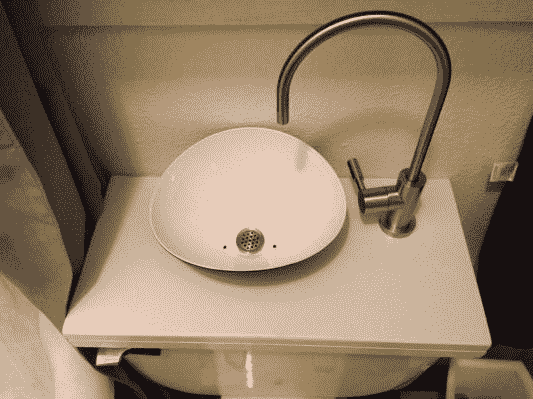
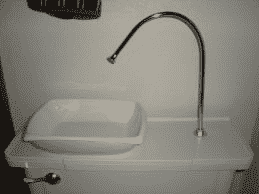
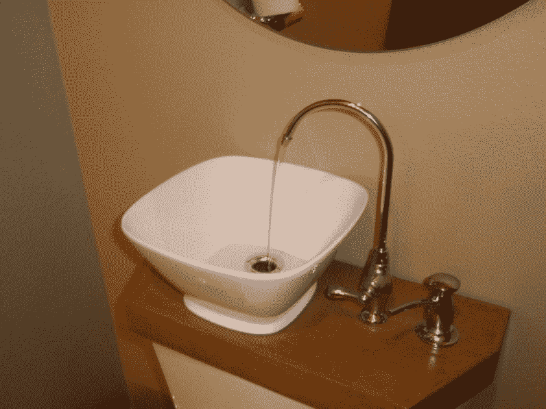

# 一步一步拯救地球

> 原文：<https://hackaday.com/2014/12/08/saving-the-planet-one-flush-at-a-time/>

水是一种自然资源，有些人认为这是理所当然的。似乎我们可以打开一个小平面来寻找无限的供应。并非世界各地都是如此。在美国，厕所用水量占家庭用水量的 27%。只使用一次就要消耗大量的水。冲水后充入马桶的水和从水槽出来的水是一样的。[格雷戈里]认为将马桶水箱的填充和洗手结合起来是有意义的，因为这两项活动同时发生。

为了做到这一点，一个 DIY 水槽和水龙头被安装在马桶水箱的供水线上。第一步是做一个新的油箱盖。[gregory]使用碎料板，并承认这可能不是最好的材料，但这是他手头上的材料。盖子上开了一个洞，里面粘了一个金属碗。在碗的底部钻了一些孔，这样水就可以排到水箱里。水龙头只是标准的铜管。使用绕线方法用手弯曲该曲线，以防止其扭结。唯一剩下的部分是将注水管线(在注水阀之后)连接到水龙头。现在，冲马桶时，水龙头开始流动。

虽然[gregory 的]项目可能增加了他的厕所使用的家庭用水的百分比，但这只是由于与厕所无关的用水的减少。这种节水模式启发了不少人制作他们自己的水槽-马桶混血儿，看看吧:

       