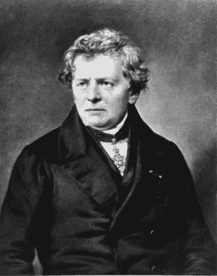

# 跟我说:输入阻抗

> 原文：<https://hackaday.com/2015/07/29/say-it-with-me-input-impedance/>

在“跟我说”系列中，我们将从电子学中取出一个常用的概念，并尽可能地解释它。如果有什么事情困扰着你，或者某个术语或概念在你的项目中不断出现，[让我们知道](https://hackaday.com/submit-a-tip/)。我们会写出来的！

输入阻抗是怎么回事？你听到人们谈论它，但是它为什么重要？阻抗匹配呢？让我们把它全部分解。

首先，阻抗是电阻的频率相关姐妹，因此出于直觉，我们将首先研究纯阻性阻抗的情况。如果你只在一个频率上工作，那几乎没问题。我们会在最后暗示成熟的`impedance = resistance + reactance`版本，但这确实是它自己的话题。现在，假设你的电路没有反应。

## 输入和输出阻抗

Georg Ohm

如果我们要讨论输入阻抗，我们需要回顾一下我们的老朋友欧姆定律。(如果有另一个等式和欧姆定律一样有用，我们也不知道。)`V=IR`。或者，求解为电流，`I = V/R`。欧姆定律的意思是，电路中流动的电流量随着电压的增加而增加，随着电阻的增加而减少。就这么简单，但是真的很厉害。

如果你想让一安培的电流流过电路，你需要将电压增加 R 伏特。或者，如果我们将电压提高 1 伏，那么流过电路的电流就会增加 1/R 安培。谢谢，格奥尔格·欧姆。

现在考虑一个电子元件。具体是什么并不重要，所以我们在这里考虑一个放大器。想象一下，无论出于何种目的，我们都希望放大器的输入端出现 3.5 V 电压。你可能认为这很简单，只要在放大器上接上一根线，加上 3.5 伏的电压就行了。这还不是故事的全部。

工程师们喜欢将放大器等器件视为简单地读取其输入端的电压电平。但我们有一个真正的放大器，它需要一些电流流入才能工作。因此，折中的办法是将真正的放大器视为内部的“理想器件”，通过一个接地电阻从输入端吸收一些电流。这个虚输入电阻的值就是器件的输入阻抗。

因此，当我们在实际器件的输入端施加 3.5 V 电压时，一些电流会流入电阻并流出到地，这反过来会降低到达内部理想器件的电压。

同样，芯片不能在任何给定的电压下输出无限量的电流。(那会很酷，不是吗？)相反，当我们要求器件提供越来越多的电流时，我们会看到其输出电压骤降。就像输入阻抗一样，我们可以将这种下降建模为一个简单的电阻:当我们要求更大的电流输出时，电压会下降多少？`V=IR`。同样，输出阻抗是该输出电阻值。

输入和输出阻抗都是一些量，您可以经常在单个元件的数据手册中查找，自己找出晶体管放大器电路，甚至[自己测量](http://www.radanpro.com/Radan2400/Theory/Measuring%20Input%20and%20Output%20Impedance.htm)。

## 感应淬火

现在，您已经了解了输入和输出阻抗背后的概念，我们可以开始考虑阻抗匹配了。粗略来说，有三种情况。第一种情况是，您需要将电压信号从一个器件传输到另一个器件，并且一切都以较低的频率运行。第二种情况是，您感兴趣的是将电能(电压乘以电流)传输到第二个器件。第三种情况适用于在高频下工作并需要将反射信号降至最低的情况。

### 电压传输:高阻抗桥接

如果是低频电压信号，实际上根本不需要匹配阻抗。相反，这适用于基本上所有的音频信号，你需要一个低输出阻抗[和一个高输入阻抗](https://en.wikipedia.org/wiki/Impedance_bridging)。

 要知道为什么，我们先来看看电路图。在两个理想的放大器级之间，我们有一对电阻形成一个[分压器](https://en.wikipedia.org/wiki/Voltage_divider):第一级的输出阻抗和第二级的输入阻抗。这意味着第二个放大器看到的电压是第一个放大器输出的缩小版。

举一个具体的例子，假设第一个放大器的输出阻抗为 1K，第二个放大器的输入阻抗为 100K，这是一个非常理想的情况。如果离开第一个理想放大器的电压为 3.5V，则到达第二个放大器的电压为`3.5V * 100K / (1K+100K) = 3.465 V`，约为初始值的百分之一。对爵士乐来说足够近了。

现在假设我们有 10K 输出阻抗和 10K 输入阻抗。到达第二个放大器的电压是`3.5V * 10K / (10K + 10K) = 1.75V`。简而言之，我们天真地认为我们得到的一半。如果我们关心模拟电压电平，那就不好了。

始终考虑由输入/输出阻抗引起的压降是一件痛苦的事情，正如我们所见，当第一个放大器的输出阻抗较小时，压降最小，而第二个放大器的输入阻抗非常高。因此，为了让我们作为设计师的生活变得轻松，我们只需寻找低输出阻抗和高输入阻抗的器件，并假装整个问题不存在。Horowitz 和 Hill 提出输入阻抗和输出阻抗之间的系数为 10。对于关键的电压相关模拟电路，越多越好。

在结束这个话题之前，请注意，如果输入阻抗较高，需要流过该系统的电流相对较少，就可以让电压信号通过。

### 动力分配装置

如果第二个设备是一个马达或天线呢？我们的目标不是在第二个器件的输入端施加一定的电压，而是尽可能多地向其传输功率。

为了传输最大功率，第二级的输入阻抗必须与第一级的输出阻抗相同。(你总是希望第一个器件的输出阻抗更低，电流源能力越大越好，但一旦达到这个极限，就要让第二个器件的输入阻抗与之匹配。)为什么？下图中，电压设置为 5V，第一个器件的输出阻抗为 1 欧姆。

 随着输入阻抗的增加，输入电压(黑线)也会升高，就像上面阻抗桥接的情况一样。但是更高的输入阻抗也意味着通过系统的电流更少(红线)。传输到第二个器件(蓝线)的功率是电流和电压的乘积。可以看到，当两个阻抗相同时，它达到最大值。

请注意，在最大功率传输时，我们将电压减半:2.5 V，而不是 5 V。如果您同时关心功率和电压传输，那么您就不走运了。

### 高频

事实证明，我们也希望在非常高的频率下匹配阻抗。为什么？因为在任何地方都会有突然的阻抗不匹配，一些信号会被反射。

在低频时，反射信号并不那么重要。它们在连接两个器件的导线中来回跳动的速度非常快，每次跳动都会被导线吸收一点，相对于我们所关心的信号频率而言，它们会很快消失。在高频(比如 300-500MHz 及以上？)，我们所关心的信号的变化时间与反射信号在导线中反弹的时间大致相同，因此目标信号及其反射信号会混淆在一起。我们想避免这种情况。

高频阻抗匹配需要权衡。通常，我们真的**关心电压信号的电平，但我们受到回波的干扰如此之大，以至于值得损失 50%的电压电平，以确保没有反射干扰信号。你只需要用一些额外的放大来补偿这种电压损失。**

综上所述，当您想要传输功率或尽量减少高频信号的反射时，您需要将第二个器件的输入阻抗与第一个器件的输出阻抗相匹配。

## 最后一点:阻抗不仅仅是电阻

到目前为止，我们一直假设我们的阻抗是纯阻性的。但大多数现实世界中的器件也有一些电容或电感，并且它们具有频率相关的电阻。电容在较高频率时电阻较低，而电感在较低频率时电阻较低。如果您的器件具有显著的容性或感性输入或输出阻抗，您还必须记住工作频率。

对于电压传输，我们只需确保输入阻抗足够高。高频时输入电容过大可能是个问题。

为了最大限度地减少高频反射，通常可以查找(或计算)所需频率下的输出阻抗，并在第二个器件的输入端添加一个简单的接地电阻来匹配它。

如果你对最大功率传输感兴趣，事情会变得混乱。电容和电感不会瞬间反应，你也需要匹配这个[电抗](https://en.wikipedia.org/wiki/Electrical_reactance)。这是一个困扰无线电传输放大器/天线系统的问题。无线电人员对让天线获得最大功率非常感兴趣，因此他们有许多技巧来使这些复杂的阻抗匹配工作。

但今天的要点是:对于功率传输或高频，请尝试使输入阻抗与输出阻抗匹配，但如果对电压信号感兴趣，请保持输入阻抗远大于输出阻抗。