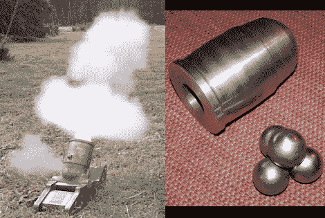

# 内战迫击炮射击钢制高尔夫球的比例模型

> 原文：<https://hackaday.com/2012/07/31/scale-model-of-a-civil-war-mortar-shoots-steel-golf-balls/>

[键盘突击队爵士]刚刚从他的机械车间出来，展示他最近完成的内战迫击炮的 1/6 比例模型。它从一些直径为 4 英寸的棒料开始，接受高尔夫球大小的钢珠作为弹药。

孔径为 1.725 英寸，这为 1.685 英寸的高尔夫球规格提供了一点间隙。每个钢珠的重量刚刚超过 11 盎司。在这个试射视频中，你可以很好地看到成品迫击炮。它很小，但[键盘突击队爵士]报告说，完整组装的单位仍然重达 40 磅。

这当然不是一种简易武器，但我们很惊讶地看到它正在试射。我们打赌它会让一些人觉得当地的射击场。

[via [Reddit](http://www.reddit.com/r/somethingimade/comments/xemwn/i_made_a_16_scale_civil_war_mortar_it_shoots_golf/)