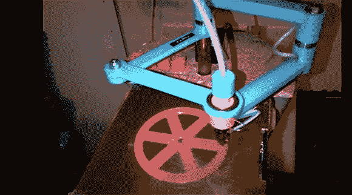

# SCARA Arm 公司终于打印出塑料零件

> 原文：<https://hackaday.com/2013/02/25/scara-arm-finally-prints-plastic-parts/>

这里有一个你在 3D 打印机上看到的普通机架设置的简洁替代方案。[Quentin]设计并制造了一台 SCARA arm 3D 打印机[，它刚刚看到了它的第一个打印机](http://reprap.harleystudio.co.za/?p=301)。

几周前我们听到了[昆汀]的 SCARA 手臂的风声,当时它还只是几个塑料部件和它的创造者眼中的一丝雄心。大多数零件都是 3D 打印的，包括由步进电机驱动的 x 轴和 y 轴的蓝色臂。z 轴由两个丝杠控制，从[Quentin]机器的高度来看，他的可打印量相当大——至少和我们见过的一些 delta bot 3D 打印机一样大。

到目前为止，[昆汀]已经打印了一些校准立方体和一个轮子，打印分辨率相当令人印象深刻。休息之后，你可以看看 SCARA arm 打印机的视频。

[https://www.youtube.com/embed/oSmo7iZ10Bk?version=3&rel=1&showsearch=0&showinfo=1&iv_load_policy=1&fs=1&hl=en-US&autohide=2&wmode=transparent](https://www.youtube.com/embed/oSmo7iZ10Bk?version=3&rel=1&showsearch=0&showinfo=1&iv_load_policy=1&fs=1&hl=en-US&autohide=2&wmode=transparent)