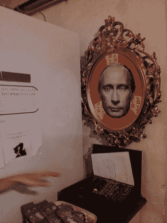

# 可怕的普京守卫你的藏匿处

> 原文：<https://hackaday.com/2012/10/08/scary-putin-guards-your-stash/>

如果任何人试图从这个硬币银行拿走任何东西，他们将不得不勇敢面对(弗拉基米尔·普京)给他们的令人毛骨悚然的眼神。这是因为[Overflo]安装了壁挂，当你靠近它时会做出反应。一切都在眼睛里，眼睛会根据你与相框的距离而张开并变红。

框架本身是[Overflo]在宜家能找到的最丑的东西。他把它喷成金色，并添加了一个滑稽背景的[普京]图像。在休息时[弗拉德]闭上了眼睛。但是盖子连接到一个伺服电机来拉动弹簧，使它们保持关闭。当你相对靠近时，红外接近传感器用于触发眼睑，但如果你伸出手，它甚至会点亮隐藏在瞳孔中的红色发光二极管。休息之后，请观看视频中的设置演示。

[https://www.youtube.com/embed/Fdg_8pkuumA?version=3&rel=1&showsearch=0&showinfo=1&iv_load_policy=1&fs=1&hl=en-US&autohide=2&wmode=transparent](https://www.youtube.com/embed/Fdg_8pkuumA?version=3&rel=1&showsearch=0&showinfo=1&iv_load_policy=1&fs=1&hl=en-US&autohide=2&wmode=transparent)