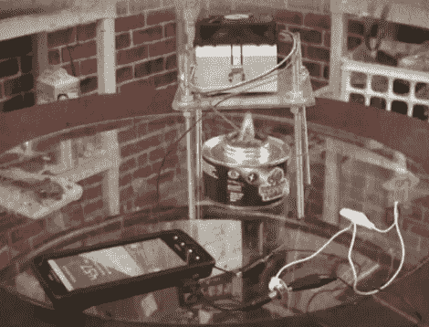

# 从消费电子产品中提取能量来制造一个火焰驱动的手机充电器

> 原文：<https://hackaday.com/2012/05/18/scavenging-from-consumer-electronics-to-make-a-flame-powered-phone-charger/>

[Gigafide]刚刚完成了这个火焰动力手机充电器的制作。这个概念并不新鲜。他抓起一个珀耳帖冷却器，利用火焰和散热器之间的温差来产生充电器使用的电力。如果你在这里搜索足够多，你会发现许多蜡烛供电的设备，还有一些黑客在[用一种更有趣的方式](http://hackaday.com/2011/07/02/poor-mans-peltier-air-conditioner/)使用帕尔贴设备。但我们真的很喜欢他的高生产价值的视频，简单易懂的概念解释，以及在消费设备中寻找组件的能力。我们认为你不会对休息后发现的他的视频感到失望。

珀耳帖装置来自 USB 饮料冷却器。它由一个由电箱盖和螺杆制成的金属支架支撑。下面他用的是食品工业用的凝胶燃料罐，上面是 CPU 散热器和风扇。这种设置输出约 1.5V，但他需要一个升压转换器来为手机充电。一个 AA 电池充电器意味着在紧要关头给你的手机充电，非常适合这种应用。

[https://www.youtube.com/embed/17VU2FkfDOM?version=3&rel=1&showsearch=0&showinfo=1&iv_load_policy=1&fs=1&hl=en-US&autohide=2&wmode=transparent](https://www.youtube.com/embed/17VU2FkfDOM?version=3&rel=1&showsearch=0&showinfo=1&iv_load_policy=1&fs=1&hl=en-US&autohide=2&wmode=transparent)