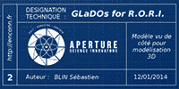
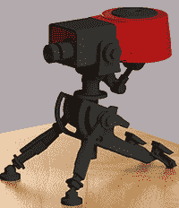

# 科幻竞赛综述:阀门宇宙

> 原文：<https://hackaday.com/2014/04/21/sci-fi-contest-roundup-the-valve-universe/>

虽然我们的科幻竞赛的大部分参赛作品来自电影和电视节目，但也有少数作品基于阀门宇宙，包括一些基于*门户*和*团队要塞 2 的作品。*

#### 致命的神经毒素

谁不想要一个巨大的关节式反社会机器人在周围晃荡呢？两个小组正在从*门户*系列中克隆格拉多斯。建筑看起来真的很棒。

[AmarOk]开发了一个名为 RORI 的开源个人助理，旨在成为 GLaDOs 的一个更有用的版本，没有所有的测试和杀戮。他与[Peterb0y]和[n0m1s]一起，正在将这个个人助理软件变成 GLaDOs 的复制品。

采取稍微不同的策略，[Eric]和[jjyacovelli] [建造了一个类似 GLaDOs 的机器人](http://hackaday.io/project/629)，在“脸”上有一个摄像头。这个摄像头连接到谷歌眼镜，并跟踪用户的头部运动。机器人身体的末端还连接着一把 Nerf 枪，由双重眨眼触发。是的，这是一个平视显示器 GLaDOs，完美的惩罚你的测试对象。

#### 重载通过！

为了不被恶毒的超智能人工智能打败，[泰勒]和[瑞安]正在建造整个西德克萨斯最可爱的武器。这是来自*团队要塞 2* *，*的一级哨兵，他们正在把一个变成彩弹哨兵。

TF2 哨兵是一个可爱的小家伙，能够进行运动跟踪和周边防御，如果敌人靠得太近，就用铅填充敌人。

虽然最终结果可能不会像[“官方”现实生活中的炮塔](https://www.youtube.com/watch?v=Uy1Ryxe44m0)一样大或一样重，但一个更小的桌面大小的模型可能更实用一点。就算不争气，升级哨兵也只是用扳手敲几下就行了。

还有时间让你拼凑出一个很棒的科幻项目，并有机会赢得一些很棒的奖品。