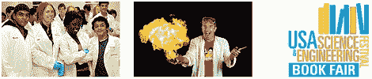

# 科学与工程节来到 DC

> 原文：<https://hackaday.com/2012/04/21/science-and-engineering-festival-comes-to-dc/>

如果你下周末在华盛顿和 DC 都会区附近，[这里有些东西适合你](http://www.usasciencefestival.org/2012festival/finale-expo/2012-exhibits)。这是美国科学与工程节，如果你想和《流言终结者》中的[亚当]和[杰米]，以及几位宇航员交谈，这是你下周末应该去的地方。

这是第二届美国科学与工程节。第一个节日，因为国会的一项法案而诞生。上一届电影节非常成功(也很有趣)，所以我们迫不及待地想看到下个周末的报道。这一次，将会有猎户座服务舱的比例模型，F-22 座舱演示器，以及 F-35 垂直起飞的演示。是的，洛克希德·马丁公司正在举办这个节日，但它仍然很酷。

尽管网站上说这个节日是面向儿童的，但我们相信我们会玩得很开心。这里有一个解决方案:借一个侄女或侄子，让他们看看工程能做什么。

我们必须指出，当你在 DC 的时候，你也可以参观美国宇航局戈达德太空飞行中心。从即将举办音乐节的会议中心乘坐地铁(有公共汽车接送)只需很短的时间。我们强烈推荐参观该设施。如果有人知道下周末你能否在乌德瓦尔-哈齐中心看到航天飞机*发现号*和*企业号*，请给我们写信。我们将修改我们的 DC“看看酷的东西”的建议。

向[保罗]致敬，感谢他送来这封信。