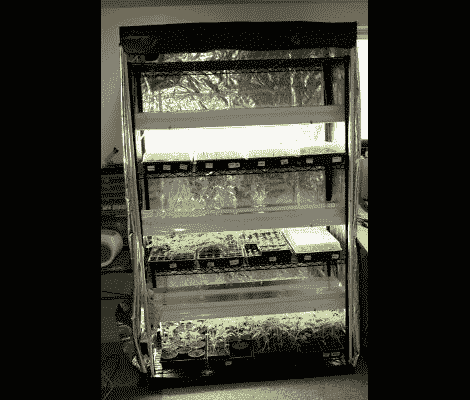

# 临时搭建的花园托儿所使用 Arduino 监控

> 原文：<https://hackaday.com/2012/06/01/scratch-build-garden-nursery-uses-arduino-monitoring/>

在室内开始种植有助于确保高产。这是因为这些植物在天气变暖到可以入土之前就已经领先了。但这一过程涉及大量的劳动，确保每天在正确的时间开灯和关灯，确保发芽和生长的温度以及湿度达到一定的目标。很明显，一点自动化是很好的，这个基于 Arduino 的花园苗圃就是这么做的。这个项目与众不同的一点是，它向你展示了如何从一个空房间到这里看到的大量植物启动器。

在很大程度上，设备是你所期望的，种子托盘和盖子，托盘保温垫，荧光灯具。由于采用了可调节搁架单元，整个装置占地面积很小。Arduino 与 [a Sprout Board](http://www.inventgeek.com/2012-Projects/Automated-Nursery/Summary.aspx) 配合使用，增加开关灯和暖垫的连接性。这只是一个驱动继电器切换电源电压的问题，可以采取任何形式，包括[我们前几天看到的这个家庭自动化项目](http://hackaday.com/2012/05/28/building-the-backend-of-internet-controlled-devices/)。

[谢谢汤姆]