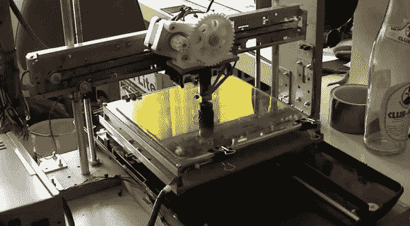

# 临时构建的 3D 打印机显示出坚如磐石的性能

> 原文：<https://hackaday.com/2013/04/30/scratch-built-3d-printer-shows-rock-solid-performance/>

如今，出去买一台 3D 打印机非常容易(而不是非常便宜)。但是，如果你有像马里奥·卢卡斯这样的疯狂技能，也许你可以用一堆清理出来的零件 ( [翻译](http://translate.google.com/translate?sl=en&tl=de&js=n&prev=_t&hl=en&ie=UTF-8&eotf=1&u=http%3A%2F%2Fwww.mariolukas.de%2F2013%2F04%2Frepstrap-3d-drucker-aus-computerschrott-teil-6%2F))来[构建一个 3D 打印。他已经发表了六篇关于这个版本的文章，并且整理了一个视频，你可以在休息后观看。](http://www.mariolukas.de/2013/04/repstrap-3d-drucker-aus-computerschrott-teil-6/)

在一台扫描仪和四台不同的打印机中发现了一堆回收的零件。他还用一台旧的个人电脑 PSU 驱动这个东西。热床和挤出机是全新的，这是一个明智的投资。我们不确定螺杆和轴承，但我们打赌这些也是新的。当需要在电子设备上工作时，他选择了 Arduino 板作为打印机和计算机之间的媒介。它使用四个步进电机驱动板来驱动轴。连接可能有点复杂，他实际上在开发阶段“抽”了一块板。

其中一个机械制造岗位显示了一个 T 型路线的皮带。我们想知道它的功能是否类似于这款 H-bot 风格打印机使用的？

[https://www.youtube.com/embed/3EZFL9W5wNk?version=3&rel=1&showsearch=0&showinfo=1&iv_load_policy=1&fs=1&hl=en-US&autohide=2&wmode=transparent](https://www.youtube.com/embed/3EZFL9W5wNk?version=3&rel=1&showsearch=0&showinfo=1&iv_load_policy=1&fs=1&hl=en-US&autohide=2&wmode=transparent)