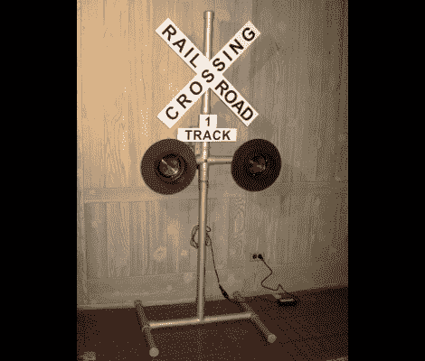

# 临时修建的铁路道口信号

> 原文：<https://hackaday.com/2012/07/16/scratch-built-railroad-crossing-signal/>

乍一看，你可能会认为这是真的，但[Kevin] [用你能在家庭商店找到的零件制作了这个铁路道口信号](http://www.kevinmfodor.com/home/My-Blog/operatingrailroadsignalcrossing-ii)。我们不断看到[交通灯被用作联网信号装置](http://hackaday.com/2012/06/13/traffic-signal-controller-pulls-data-over-wifi/)。对于这种类型的设置，这将是正确的，但[Kevin]在建造它时考虑到了铁路爱好者。

他使用 Google SketchUp 来设计信号框架，然后购买所有的 PVC 部件来匹配这些规格。一些灰色喷漆使它看起来像钢管。但是这要容易得多，他应该很容易在以后内化线路。这些灯本身是拖车的尾灯，带有一个附加的装饰件。他设计了自己的驱动板来开关灯和按门铃，这给了信号一些声音。他的第一个版本使用 555 定时器，这个升级到微控制器。我们喜欢他在休息后的视频中所做的事情，但认为铃声的速度需要加倍，才能完美地模仿真实的事情。

[https://www.youtube.com/embed/4bryCb7wb8Q?version=3&rel=1&showsearch=0&showinfo=1&iv_load_policy=1&fs=1&hl=en-US&autohide=2&wmode=transparent](https://www.youtube.com/embed/4bryCb7wb8Q?version=3&rel=1&showsearch=0&showinfo=1&iv_load_policy=1&fs=1&hl=en-US&autohide=2&wmode=transparent)