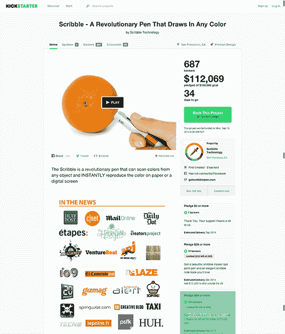

# Scribble:等等，Kickstarter 现在在审核项目？

> 原文：<https://hackaday.com/2014/08/14/scribble-wait-kickstarter-is-vetting-projects-now/>

阅读任何东西的第一条规则:如果标题是疑问句，答案是响亮的“不”。这可能是该规则的一个例外。

[这个 Kickstarter](https://www.kickstarter.com/projects/230659454/scribble-a-revolutionary-pen-that-draws-in-any-col) 其实还蛮有意思的。请注意，这不是因为这是一个明显的骗局，因为实际上很少有什么可以称之为骗局。值得一提的是，它本来有望成为一个非常成功的活动，但**在推出几天后就被创作者关闭了。**

 *在讨论 Kickstarter 活动的不愉快之前，先回顾一下历史。几年前，在众筹成为一件事情之前，一位设计师想出了一个相当聪明但完全不可能的主意:[一支颜色挑选笔](http://www.tuvie.com/color-picker-by-jinsun-park/)。只需将笔的末端靠近一个物体，按下一个按钮，使用技术和/或魔法，这支笔就可以用那种颜色书写。设计中有明显的缺点，比如使用红色、绿色和蓝色墨盒进行颜色混合——这是混淆加色和减色模型的典型案例。不过，这只是一个设计概念，多年来，混合墨水的颜色感应笔的想法已经在互联网上传播开来。有足够多的人愿意砸钱在他们的屏幕上，希望真正得到一个像这样有趣的产品，你就*知道*它迟早会出现在 Kickstarter 上。

[输入涂鸦笔](https://www.kickstarter.com/projects/230659454/scribble-a-revolutionary-pen-that-draws-in-any-col)。是的，这与 5 年多前的颜色选择笔的想法相同，只是已经解决了一些技术挑战。他们使用 CMYK(加白色)颜色模型，理论上可以复制任何颜色，并且可以在任何颜色的纸上复制。他们是怎么做到的？我不知道，但整个活动非常非常粗略。

上面你看到了 Scribble Kickstarter 在发布日的屏幕截图，银行里已经有 112，000 美元了。它具有一场非常成功的战役的所有标志；五个小时就筹足了资金，一个流畅的视频，一个精彩的故事，广受媒体欢迎。他们被 Huff Po，VentureBeat，Gawker 帝国的大部分，以及…等等，Hackaday？我们怎么会在那里结束？

哦，[这就是为什么](http://hackaday.com/2014/06/08/hackaday-links-june-8-2014/)。一个 Hackaday 链接帖子，我在那里指出他们的项目是多么粗略。在“尽量不要粗略”这一方面，这对他们真的没有帮助。

我实话实说。Scribble pen 已经在我的雷达上有一段时间了，我一直想对这个已经失败的 Kickstarter 进行彻底的解构。为什么？因为这支笔的规格太离谱了。

在现已取消的 Kickstarter 上，笔的规格极其模糊，只简单地将笔内的处理器列为“一只手臂”。这没有什么不好，因为你可以找到 ARM 微控制器，它可以安装在针头或笔身上。Scribble 网站的 Wayback Machine archive 更具体一点:他们计划使用 ARM 9 处理器。这只是猜测，[但我认为他们指的是 ARM9](http://www.arm.com/products/processors/classic/arm9/index.php) ，也就是你会放在手机里的那种处理器，或者需要大量计算能力的东西。如果你能在一个非常小的外形中避开墨水分配的机制，一只颜色感应笔就永远不需要那么强大的处理器。这就像用兰博基尼去超市一样。

实际上，不。这和在蓝宝里买些杂货完全相反。一支 ARM9 放入这支笔是极不可能的。就像用翻斗车去超市一样。

根据 archive.org 缓存，涂鸦笔的直径是 15 毫米。我能找到的最小的基于 ARM9 的 CPU 是 Atmel SAM9260，一个 15 毫米见方的 217-LFBGA 封装。有 10mm 方形 ARM9 BGA 封装的参考*。*加上笔的壁厚、安装处理器的电路板，潦草的设计几乎是不可能的。尽管处理器的选择很荒谬，或者在如此小的设备中分配五种颜色的墨水存在挑战。

直到现在我都没有发表任何关于涂鸦的东西，因为我在等待团队的回复。上周一，我给他们发了电子邮件，询问他们关于 archive.org 缓存和现已倒闭的 Kickstarter 之间芯片选择的明显变化。他们没有回复我；有点令人惊讶，因为我们显然有足够酷的尾巴可以骑。此后，Kickstarter 发出了最后通牒。这是直接来自涂鸦笔背后的人:

> 亲爱的支持者们，
> 
> 在你们惊人的支持下，我们在 5 小时内达到并超过了最初的目标。
> 
> 鉴于许多人要求更好地了解和理解 Scribble Pen 和 Scribble Stylus 的工作原理，我们目前正在拍摄另一个更深入的视频，该视频将于下周发布。
> 
> 然而，我们从 kickstarter 收到了一封日期为 08/12/14 的电子邮件，要求在 24 小时内提供一个新的更具说明性的视频，所以我们不得不取消了这个项目，希望通过一个更详细的视频重新开始。

是的，显然 Kickstarter 确实对项目进行了一些审查。一旦这些人可以拍摄更多的视频，Scribble 就会回来。这种事不是你能轻易伪造的。哦等等。你可以。

[https://www.youtube.com/embed/A0utewCzdF4?version=3&rel=1&showsearch=0&showinfo=1&iv_load_policy=1&fs=1&hl=en-US&autohide=2&wmode=transparent](https://www.youtube.com/embed/A0utewCzdF4?version=3&rel=1&showsearch=0&showinfo=1&iv_load_policy=1&fs=1&hl=en-US&autohide=2&wmode=transparent)

当这个 Kickstarter 被取消时，Scribble 团队坐拥 366，000 美元，一些预测称，他们将在活动结束时看到大约 500 万美元。实际上，我对 Scribble 团队*没有*决定“在发布后修复它”并继续活动感到有些惊讶。别担心。他们会回来的，下一次他们可以合法地在他们的活动中使用 Hackaday 标志。*