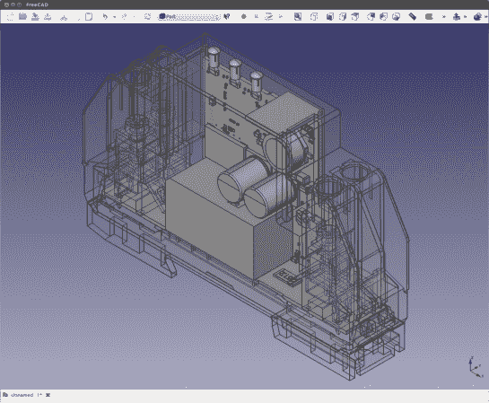

# 脚本允许您导入 Eagle 板以在 FreeCAD 中使用

> 原文：<https://hackaday.com/2013/02/11/script-lets-you-import-eagle-boards-for-use-in-freecad/>

[Christian Aurich]想要在适当的 CAD 程序中使用他的 Eagle CAD 电路板设计，以便设计外壳。这方面已经有了一些选择，但它们并不完全符合他的需求，所以他开发了一个脚本来将 Eagle boards 导入 FreeCAD。该脚本被打包为[一个用于 FreeCAD](https://github.com/ch-aurich/Eagle2FreeCad) 的 python 宏。

在描述现有产品的缺点时,[Christian]确实提到了在 Google SketchUp 中使用 EagleUp 来建模电路板。但他认为 SketchUp 产生数据的方式使这些模型能够很好地与 3D 打印一起工作，但他表示，它们不容易与机械设计 CAD 软件一起使用。他还觉得[照片般逼真的效果图](http://hackaday.com/2012/06/05/this-is-not-real-lifelike-renderings-from-eagle-files/)在开发外壳时毫无用处。

值得一提的是，这种方法之所以可行，是因为 [CadSoft 向 XML](http://hackaday.com/2010/10/14/cadsoft-eagle-migrating-to-xml/) 的迁移使得获取数据变得非常简单。