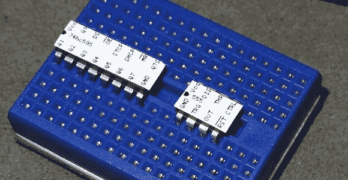

# 脚本为您的芯片定制引脚标签

> 原文：<https://hackaday.com/2013/03/15/script-makes-custom-pinout-labels-for-your-chips/>

经过多年的业余爱好电子产品的原型制作，我们已经(实际上是几次)了解到，当一些东西不工作时，它是硬件的问题。通常跳线没有正确连接，或者我们需要放一个上拉电阻，但忘记了。有一件事可以真正帮助快速解决这些问题，那就是为每个芯片贴一个引脚标签，就像上面看到的那样。这是[约翰·米查姆]提出的一个项目。它使用脚本在标签制作机上生成芯片引出线。

他入手的标签制作机是兄弟 PT-1230PC。它通过 USB 连接到计算机，可以使用几种不同宽度的自粘标签带。[John]发现 1/4”宽的胶带几乎非常适合 PDIP 组件。

他的脚本将一个 YAML 文件作为输入。这种格式标准使得只需使用文本编辑器就能快速、轻松地为新芯片制作标签。从那里，他的 Pearl 脚本将数据转换成可移植的网络图形(。png)文件，其标签间距为芯片的 0.1”间距。将这张图片发送给你的标签制造商，你将得到一张不干胶提示，这将有助于减少你翻遍数据手册寻找引脚排列的时间。