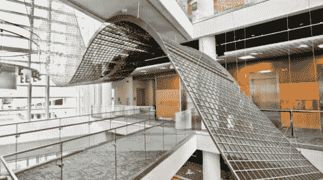

# 用 LCD 像素雕刻

> 原文：<https://hackaday.com/2012/09/14/sculpting-with-lcd-pixels/>

这个雕塑中的每一个小方块实际上都是一个 LCD 单元，而这只是冰山一角。你在这里看到的只是横跨北卡罗来纳州自然科学博物馆中庭多层的雕塑的一小部分。它由多个面板组成，总共包含 3600 个液晶单元。[我们第一次看到它](http://hackaday.com/2012/04/27/gigantic-liquid-crystal-display-is-like-a-giant-calculator/)是在四月份，但是现在有一个“制作”的视频，你可以在休息后看到嵌入的视频。

该项目花了大约 18 个月完成，从一个 256 像素的原型开始。这证明了不发光的硬件会达到他们想要的效果。在那里，他们设计了在雕塑上生成图案的代码，并用它来驱动一个数字模型(我们打赌这是为了获得许可和资金)。焊接电路时形成的三人装配线的快动作镜头看起来很有趣，真正令人紧张的是他们开始在空间中安装易碎的面板。

[https://player.vimeo.com/video/49359256](https://player.vimeo.com/video/49359256)

[谢谢斯蒂格]