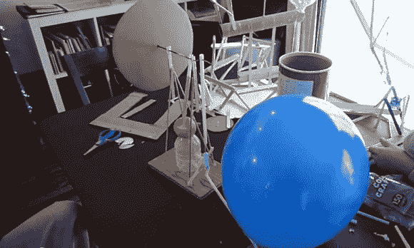

# 二年级科学项目:蒸汽机

> 原文：<https://hackaday.com/2013/03/20/second-grade-science-project-a-steam-engine/>

如果你正在寻找一种方法让孩子们接触科学，这是一个如何做的完美例子。[Erich]想帮他 7 岁孩子的科学项目。他们决定建立一个蒸汽机的工作模型，但找不到适合该年龄组的在线说明。所以他们两个不仅完成了构建，而且还写了一份指南，供其他人遵循。问题是，你真的必须理解一个概念，才能把它教给别人。所以我们认为写报告和实际做实验同等重要。

如果你不小心，蒸汽会烫伤你。但是你并不真的需要蒸汽来探索蒸汽机的概念。使用蒸汽的主要原因是，这是一种相当基本的方式来建立压力，可以转换成运动。在这个演示中，蓝色气球提供了压力。它在给一个蓄水池供水，这个蓄水池连接着一个用吸管做成的阀门。内部的塑料活塞推动曲轴，旋转左边的纸板轮。当活塞经过阀门开口时，它释放空气压力，直到机器旋转一周，并处于下一次推动的位置。这在休息后的片段中得到了很好的展示。

[https://www.youtube.com/embed/co7U6_bvkOw?version=3&rel=1&showsearch=0&showinfo=1&iv_load_policy=1&fs=1&hl=en-US&autohide=2&wmode=transparent](https://www.youtube.com/embed/co7U6_bvkOw?version=3&rel=1&showsearch=0&showinfo=1&iv_load_policy=1&fs=1&hl=en-US&autohide=2&wmode=transparent)