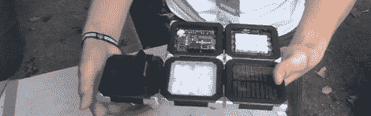

# Seeed 工作室展示他们的产品

> 原文：<https://hackaday.com/2012/10/04/seeed-studio-shows-off-their-wares/>

每个人最喜欢的开放式五金店—[Seeed Studio](http://www.seeedstudio.com/)—在上周末的 Maker Faire 上。他们展示了一堆很酷的玩具、示波器、Arduino 盾牌和其他硬件好东西，但其中一个更有趣的产品来自[他们的 B Squares 线](http://www.seeedstudio.com/depot/bsquares-c-205.html)。

Seeed [的[Colin]向我们展示了](http://www.youtube.com/watch?v=VrTqa3GgG9Y&feature=plcp)，每个 B 方块都是一个小塑料外壳，大约有饮料杯垫那么大。这些正方形的角上包着金属，每个里面都有磁铁。B Squares 系统背后的想法是通过磁性连接向其他 B Square 板提供电力。

到目前为止，Seeed 已经发布了 Arduino 方块、电池、太阳能和 LED 方块，以及 iPod 基座和原型板。这些木板也可以是正交的，这意味着完全有可能将六个 B 正方形变成一个 B 立方体。

这些磁性连接仅提供电源连接；目前没有办法在不同的 B 方块之间传输数据。然而，我们怀疑，任何想要复制苹果 MagSafe 电源适配器并发明磁性 I2C 总线的人都会发现这些板非常适合这项任务。

休息后的视频。

[https://www.youtube.com/embed/VrTqa3GgG9Y?version=3&rel=1&showsearch=0&showinfo=1&iv_load_policy=1&fs=1&hl=en-US&autohide=2&wmode=transparent](https://www.youtube.com/embed/VrTqa3GgG9Y?version=3&rel=1&showsearch=0&showinfo=1&iv_load_policy=1&fs=1&hl=en-US&autohide=2&wmode=transparent)