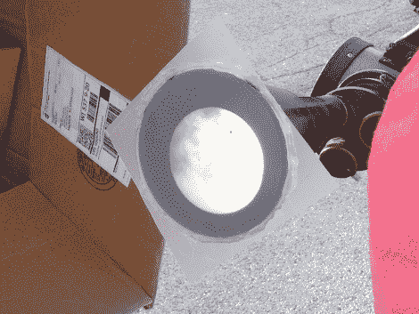
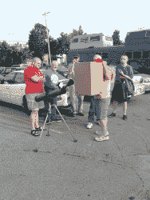
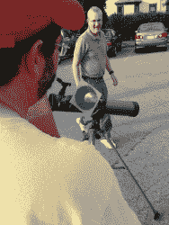
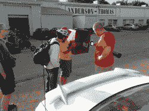
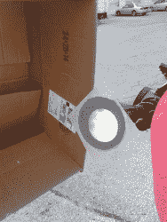
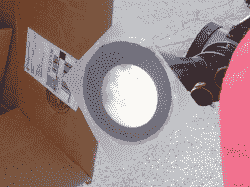

# 观看金星凌日；这就是为什么你应该访问你当地的黑客空间

> 原文：<https://hackaday.com/2012/06/06/seeing-the-venus-transit-this-is-why-you-should-visit-your-local-hackerspace/>

所以我想买一副防护眼镜，这样我就可以在昨天金星凌日的时候安全地盯着太阳。但后来天气预报说下午会多云(这里的活动要到下午 5 点才开始)，所以我就把它忘了，想着下次要设法赶上它(这是 105 年后的事了)。

我开始了新的生活，吃了点晚餐，然后拿起我最新的项目，前往威斯康星州麦迪逊当地黑客空间的每月例会。不料我到了停车场发现了这一景象: 

当然，我的优先权可能已经把观看推到了一边。但是其他人把在一生中看到一次或两次这样的事件作为他们的使命，而我看到它只是因为和他们在同一个地方。这是黑客空间的核心…协作。新思想、动机和灵感的源泉。

其中一名成员带了一架望远镜，并上网了解如何安全地使用它进行观察。他花了大约 2.5 美元组装了一个漏斗，上面覆盖着一块醋酸纤维，与望远镜的目镜相接。顶部的图像显示了整个太阳，尽管可以清楚地看到一些云层，但金星就像白天一样清晰。纸板盒只是在漏斗周围提供了一个遮蔽的观看区域。和大多数宇宙经历一样，它比描述的要酷得多，这让我感到惊讶。休息之后在画廊看几张额外的图片。

