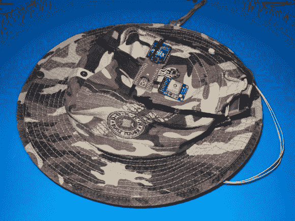
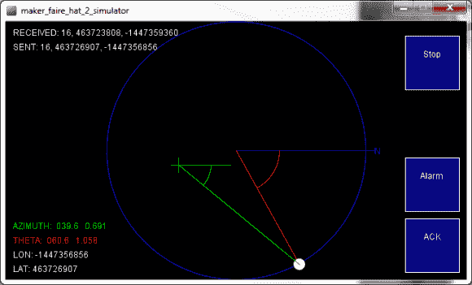

# 探索者帽子通过定向发光二极管找到彼此

> 原文：<https://hackaday.com/2014/06/18/seeker-hats-find-each-other-with-directional-leds/>

[John Petersen]为他和他的儿子创造了一个非常酷的可穿戴技术。渴望探索创客博览会，但又不想在人群中失去儿子，他想出了[探索者帽](https://github.com/JohnPetersen/Seeker_Hats)——一种自动定位的 GPS 帽子，总是指向另一个人。

这是一个聪明的设置，它利用了 GPS 模块、微处理器、xBee 无线芯片、指南针和 led 来照亮道路。GPS 确定帽子的大致位置，xBee 将其传输到另一顶帽子，数字罗盘确定两顶帽子的方向，微处理器计算出方位角，从而导致两顶帽子的轨迹不同——一条 led，像着陆灯一样，指引你正确的方向。

在未来，[约翰]希望创建一个网状网络，这样两顶以上的帽子就可以参与进来，甚至可能制作一个手持“定位器”设备，而不是一顶帽子——但他面临的最大问题是他的儿子会关掉他的帽子。孩子们。