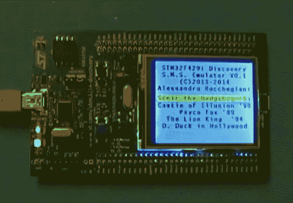

# STM32 开发板上的 Sega 主系统

> 原文：<https://hackaday.com/2014/01/14/sega-master-system-on-a-stm32-development-board/>

一些黑客已经成功地将 STM32 开发转化为世嘉主系统仿真器。这意味着刺猬索尼克在手臂皮层上奔跑——M4。

这个黑客有几个部分。首先，[Alessandro Rocchegiani]展示了他的 [Sega 主系统仿真器](https://www.youtube.com/watch?v=qtNLctyoxU8)在 [STM32F429 Discovery](http://www.st.com/web/catalog/tools/FM116/SC959/SS1532/PF259090) 开发板上运行的视频。第一个版本使用板载 2.4 英寸 TFT LCD 屏幕。

[Fabrice]已经在使用 STM32 发现板了。他开发了一个扩展板，为开发套件增加了许多功能，包括一个用于视频输出的 T2 R-2R DAC。当[Fabrice]发现世嘉主系统模拟器时，他与[Alessandro]和他的儿子[Fabrizio]合作，让 VGA 输出工作。他们还使用[Fabrice]的[Wii 库](https://sites.google.com/site/suprabotics/home/stm429-wii-classic-controller)增加了对 Wii 控制器的支持。结果是一个具有 640 x 480 的 VGA 输出的 [Sega 主系统仿真器，具有 16 位颜色和 Wii 控制器支持。](https://sites.google.com/site/suprabotics/home/stm32f429-sega-master-system-emulator)

休息之后，你可以观看 LCD 和 VGA 版本的黑客视频。

[https://www.youtube.com/embed/qtNLctyoxU8?version=3&rel=1&showsearch=0&showinfo=1&iv_load_policy=1&fs=1&hl=en-US&autohide=2&wmode=transparent](https://www.youtube.com/embed/qtNLctyoxU8?version=3&rel=1&showsearch=0&showinfo=1&iv_load_policy=1&fs=1&hl=en-US&autohide=2&wmode=transparent)

[https://www.youtube.com/embed/oz4leSl8n-U?version=3&rel=1&showsearch=0&showinfo=1&iv_load_policy=1&fs=1&hl=en-US&autohide=2&wmode=transparent](https://www.youtube.com/embed/oz4leSl8n-U?version=3&rel=1&showsearch=0&showinfo=1&iv_load_policy=1&fs=1&hl=en-US&autohide=2&wmode=transparent)