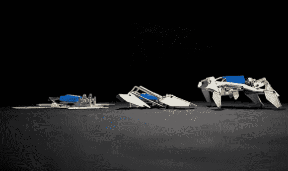

# 自我组装折纸机器人

> 原文：<https://hackaday.com/2014/08/11/self-assembling-origami-robots/>

麻省理工学院的工程师开发了一种技术，以廉价和可获得的水平解决制造机器人所涉及的挑战。就像植物展开花瓣，蛋白质折叠成形，或者昆虫展开翅膀一样，这个[自主折纸设计](http://wyss.harvard.edu/viewpressrelease/162/robot-folds-itself-up-and-walks-away)展示了机械生物组装自己并走开的能力。这项技术开启了将成群的扁平机器人释放到难以到达的地方的可能性。一旦到达现场，机器人从地面开始动员。

该项目背后的团队使用了由纸张和聚苯乙烯制成的柔性印刷电路板，聚苯乙烯是一种合成的芳香族聚合物，通常存在于商业销售的儿童玩具 Shrinky Dinks 中。每个铰链都嵌入了机械编程的电路，可以折叠成特定的角度。加热复合结构，引发折叠过程。大约四分钟后，铰链会冷却，让聚苯乙烯硬化。尽管在最初的设计阶段出现了一些问题，因为运行机器人的电流量是普通灯泡的十倍。这导致最初的原型在建造工程完成之前就被烧毁了。

从长远来看，核心教员[Robert]希望拥有一个设施，为周围社区的任何人提供日常的机器人协助。这个地方对附近的每个人都是开放的，帮助解决任何可能出现的问题，这听起来非常像一个黑客空间。无论这个人需要一个检测气体泄漏的设备还是一个门廊清扫机器人，这些设施都会在那里帮助住在附近的成员。

休息之后，[Robert]和[Sam]会播放一段描述这个项目的视频:

[https://www.youtube.com/embed/9M1zNIVGrjM?version=3&rel=1&showsearch=0&showinfo=1&iv_load_policy=1&fs=1&hl=en-US&autohide=2&wmode=transparent](https://www.youtube.com/embed/9M1zNIVGrjM?version=3&rel=1&showsearch=0&showinfo=1&iv_load_policy=1&fs=1&hl=en-US&autohide=2&wmode=transparent)