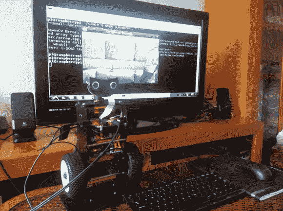

# 自平衡机器人不断获得更多功能

> 原文：<https://hackaday.com/2013/11/10/self-balancing-robot-keeps-getting-more-features/>

看到自平衡机器人项目很有意思。他们很少能走得更远，当被他们的创造者遥控和恼人地推搡时，他们能够保持直立，以证明他们有能力用两个轮子站立。这个拟人化的小家伙[是规则](http://letsmakerobots.com/node/38610)的例外。这是塞缪尔·马托斯(Samuel Matos)的产品，他说他心里没有特定的目的，只是不断地添加新功能。

从几块碳纤维板开始,[Samuel]手工切割设计，使用支架安装 NEMA 17 步进电机，并连接底盘的两半。看起来他用一些剩余的材料做了一个很好的小架子，当他在桌子上写代码的时候很好，如上图所示。还有一个碳纤维面具，构成了铰接脖子上的脸。它有两个超声波测距传感器作为眼睛，树莓 Pi 相机模块作为鼻子。RPi 板足够强大，可以运行 OpenCV，这让[Samuel]很忙。他在自己的客厅里设置了一个课程，其中包含了指导小家伙应该去哪里的标签。当网球在房间里滚动时，它也能跟随它。我们在休息后的剪辑中发现最令人印象深刻的是它在转弯后定位下一个标签的能力。

[https://www.youtube.com/embed/O6XkH84JYjU?version=3&rel=1&showsearch=0&showinfo=1&iv_load_policy=1&fs=1&hl=en-US&autohide=2&wmode=transparent](https://www.youtube.com/embed/O6XkH84JYjU?version=3&rel=1&showsearch=0&showinfo=1&iv_load_policy=1&fs=1&hl=en-US&autohide=2&wmode=transparent)

[途径 [Adafruit](http://www.adafruit.com/blog/2013/11/08/self-balancing-raspberry-pi-image-processing-robot-raspberry_pi-piday-raspberrypi/)