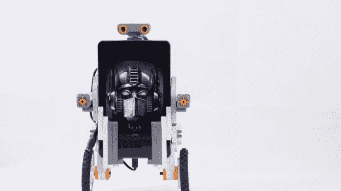

# 自平衡机器人使用安卓和乐高 NXT

> 原文：<https://hackaday.com/2014/07/16/self-balancing-robot-uses-android-and-lego-nxt/>

自平衡机器人非常酷，但有时制造起来有点复杂。[HippoDevices]向我们展示了这真的没有那么难，你甚至可以用乐高 NXT 和一个安卓设备[做到！](http://www.instructables.com/id/How-to-use-an-Android-device-and-Lego-NXT-to-build/)

第一步是制造你的两轮机器人——疯狂吧！只要乐高 NXT 马达足够强大，你就能让大多数不同形状的机器人轻松保持平衡。你需要一个安卓 ADK 板来提供乐高汽车和你的安卓设备之间的通讯。[HippoDevices]正在使用他们自己的设计，名为 [Hippo-ADK](https://www.kickstarter.com/projects/hippo-devices/hippo-adk-create-your-dream-gadget-with-a-smart-de) ，目前正在 Kickstarter 上。

这使得你的 Android 设备可以读取状态并控制乐高电机——从那里，只需根据设备的陀螺仪对其进行编程以实现平衡。

而且由于你的机器人上已经有了智能设备，你可以用另一个安卓设备来控制它！

[https://www.youtube.com/embed/aoi_EbrDrvA?version=3&rel=1&showsearch=0&showinfo=1&iv_load_policy=1&fs=1&hl=en-US&autohide=2&wmode=transparent](https://www.youtube.com/embed/aoi_EbrDrvA?version=3&rel=1&showsearch=0&showinfo=1&iv_load_policy=1&fs=1&hl=en-US&autohide=2&wmode=transparent)

[https://www.youtube.com/embed/dJL0YEoA8TQ?version=3&rel=1&showsearch=0&showinfo=1&iv_load_policy=1&fs=1&hl=en-US&autohide=2&wmode=transparent](https://www.youtube.com/embed/dJL0YEoA8TQ?version=3&rel=1&showsearch=0&showinfo=1&iv_load_policy=1&fs=1&hl=en-US&autohide=2&wmode=transparent)

【感谢拉链！]