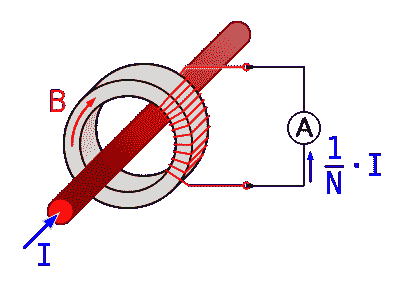

# 自建功率计使用双感应变压器

> 原文：<https://hackaday.com/2015/08/08/self-built-power-meter-uses-dual-sense-transformers/>

【雷诺】从零开始造了一个[交流功率表](http://renaud.schleck.free.fr/wattmetre.php)。虽然像 Kill A Watt 这样的商用功率计[已经上市，但雷诺的构建对所使用的方法提供了有趣的见解。](http://hackaday.com/2014/10/21/digital-data-from-a-cheap-power-meter/)

 【雷诺的】设计的核心是两个感官变形金刚。第一种是典型的降压变压器。这使得交流线路电压降至+/- 10V，更适合数字采样。第二个是电流检测变压器。在电流互感器中，初级线圈通常是一根穿过环中间的单线(在这种情况下是交流线)(见右边图片来自[维基百科](https://en.wikipedia.org/wiki/Current_transformer))。次级线圈缠绕在环上。当次级线圈短路时，初级导线/线圈中的电流在次级线圈中感应出电流。

实际上，低值电阻上的电压降用于检测次级线圈中的电流。钳形表利用这一原理进行非接触式电流测量。其他功率计通常使用[霍尔效应传感器](http://hackaday.com/2015/02/07/watt-meter-build-walks-you-through-power-measurement-basics/)进行电流测量。当[Renaud]对这个版本进行基准测试时，看看这些方法之间的比较会很有趣。

[Renaud]从这些变压器中读取电压和电流读数，并用 PIC 对其进行采样，以计算功率。由于交流电压是周期性的，【Renaud】使用类似于[等效时间采样(ETS)](http://hackaday.com/2015/07/21/fast-adc-for-laser-lab/) 的方法来组合多个周期的波形，并提高有效采样率。

好东西[雷诺]！