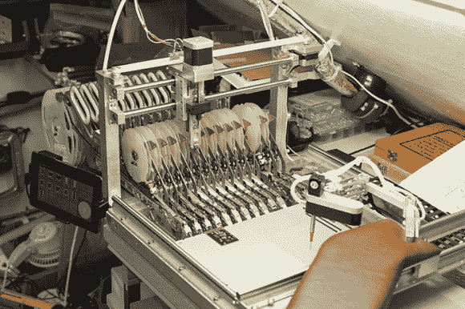

# 半自动取放机

> 原文：<https://hackaday.com/2013/04/18/semi-automatic-pick-and-place-machine/>

这是一个有趣的建立自己的选择和放置机器。它在自动化手组装的最困难部分方面做得非常出色，同时依靠人类的灵巧性来实现自动化的最困难部分。这是一台由 Arduino 驱动并由 Android 平板电脑控制的半自动取放机。

这台机器由两部分组成。左上方的部分从卷轴上输送组件，并且是全自动的。右下方的部分由一个带衬垫的扶手组成，它可以沿着两个轴平稳滑动。具有多个关节的机械臂连接到末端，最终形成一些真空镊子的尖端连接器。右撇子是唯一会发现这很方便的人，但哦，好吧。休息后的剪辑显示了它的作用。组装技术人员首先从 Android 平板电脑上的一个图标中选择组件。卷绕机然后分配该部分，该部分由真空镊子拾取，用左手再次打开和关闭真空。如果需要旋转零件方向，可以使用 Android 应用程序上的滚轮来完成。它平稳、快速，最重要的是，聪明！

[https://www.youtube.com/embed/vkPkjBfZXDg?version=3&rel=1&showsearch=0&showinfo=1&iv_load_policy=1&fs=1&hl=en-US&autohide=2&wmode=transparent](https://www.youtube.com/embed/vkPkjBfZXDg?version=3&rel=1&showsearch=0&showinfo=1&iv_load_policy=1&fs=1&hl=en-US&autohide=2&wmode=transparent)