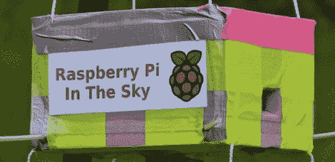

# 将树莓派送到 13 万英尺的高空

> 原文：<https://hackaday.com/2012/07/18/sending-a-raspberry-pi-to-130000-feet/>

我们知道这不会花很长时间。[大卫]上周末将一个高空气球[送入高层大气](http://www.daveakerman.com/?p=592)，使用树莓皮作为有效载荷的大脑。

[大卫]的有效载荷包括一个树莓皮，当然，有一个罗技网络摄像头，全球定位系统接收器和六节 AA 电池，连接到一个 LDO 调节器，带有一个巨大的散热器，以保持 EPX 泡沫外壳中的一切在临近空间寒冷稀薄的空气中相对温暖。

如果没有一些来自高层大气的实时数据，高空气球就没什么意思了，所以[David]使用了一个 [Radiometrix NTX2 发射机模块](http://www.radiometrix.com/content/ntx2)(有人知道美国有没有类似的部件吗？)发射的能量只有区区 10 毫瓦。尽管发射器的“官方”范围是 500 米，但[大卫]收到的图像数据却在 500 多公里外的北爱尔兰。

我们对[大卫]的飞行印象深刻——事实上，他的飞行现在是英国气球高度记录的第 12 位——但现在我们想知道拉斯皮的另一次近太空飞行能做些什么。[大卫]那里有很强的计算能力，足以从网络摄像头获取图像并将其发送到地球。现在我们想知道树莓皮在太空中还能做些什么。

你可以在休息后查看 GoPro 的视频，或者在[David]的 Flickr 上查看收到的图像[。](http://www.flickr.com/photos/daveake/sets/72157630589478676/)

[https://www.youtube.com/embed/KGLB9-LdpYM?version=3&rel=1&showsearch=0&showinfo=1&iv_load_policy=1&fs=1&hl=en-US&autohide=2&wmode=transparent](https://www.youtube.com/embed/KGLB9-LdpYM?version=3&rel=1&showsearch=0&showinfo=1&iv_load_policy=1&fs=1&hl=en-US&autohide=2&wmode=transparent)