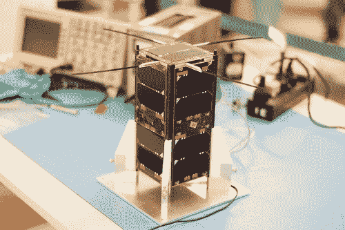

# 向太空发送开源卫星

> 原文：<https://hackaday.com/2014/05/01/sending-open-source-satellites-to-space/>

一位匿名读者向我们透露了两颗阿根廷卫星([卫星一号](http://1.cubebug.org/)、[卫星二号](http://2.cubebug.org/))于 2013 年被送上太空。他们有什么有趣的地方？它们都是基于商业现货(COTS)组件，，团队为他们的主平台发布了框架&飞行计算机软件(命名为 cubesat， [GitHub link](https://github.com/satellogic/canopus) )。Gunter 的空间页面不仅通过展示每月发送到太空的小型/业余卫星的数量给我们留下了深刻的印象，还让我们知道 CudeBug 1/2 的硬件源文件即将发布。与此同时，我们只能推断他们正在使用德州仪器的 TMS570 运行自由操作系统。然而，这两个不同的网页(西班牙语和英语)为我们提供了一个非常有趣的一瞥，向太空发送一个电子项目需要什么，以及它后来如何表现。

你可能也有兴趣看看 [ArduSat](http://hackaday.com/2012/06/15/ardusat-puts-arduino-experiments-in-space/) ，这是一个成功的 kickstarter 活动，旨在向太空发送 Arduino 实验。