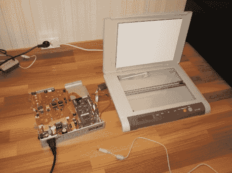

# 将正常工作的扫描仪与其损坏的打印机分离

> 原文：<https://hackaday.com/2012/04/11/separating-a-working-scanner-from-its-broken-printer/>

这台多功能一体机的激光打印机部分出了故障，[安特罗皮亚]无法让它再次工作。但是扫描仪仍在工作，所以他决定[将扫描仪从其失效的打印机模块](http://entropia.kapsi.fi/blog/2012/04/the-transformation-of-samsung-scx-4200/)中分离出来。

问题中的型号是三星 SCX-4200。这种设计实际上非常适合分离，因为扫描仪位于打印机出纸盒的顶部。它甚至可以被抬起，以便有更多的空间堆放打印好的页面。他所要做的就是分离铰链连接器并重新布置扁平电缆。但是[Entropia]心中真正的问题是，如果没有激光打印机组件与之连接，控制板是否还能工作。

他小心翼翼地拆开这个单元，将灾难性的山寨碳粉盒事件留下的碳粉洒得到处都是。快速测试显示，尽管司机抱怨纸盒打开，扫描仪仍然工作。他把左边看到的控制器板粘在扫描仪外壳的底部，并添加了一些毡脚。现在他的扫描仪更接近你所期望的尺寸。好的一面是，他获得了一个齿轮步进电机、激光扫描装置、排气扇和几个螺线管，用于未来的项目。