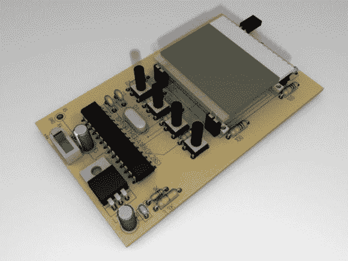

# 不带 PC 的串行监视器

> 原文：<https://hackaday.com/2014/04/08/serial-monitor-without-a-pc/>

串行监视器是调试项目的简单方法。当我们单步执行代码时，很高兴看到“嘿！我在工作，正在做下一件事！”在监视器上，什么也看不到不是很好——这是一个需要调试的错误的结果。这意味着你需要一台装有你最喜欢的串行终端程序的电脑。

大多数时候这不是问题，因为 PC 是用来编译代码和编程手头的项目。但是，如果您在现场执行修复无头系统的任务，并且需要一个串行监视器，该怎么办呢？当您可以制作自己的[外部串行监视器](http://www.instructables.com/id/ESM-ExternalSerialMonitor/)时，为什么要携带您的 PC 呢！

[ARPix]基于 Atmega328 和 [102 x 64 LCD 显示器](http://www.mouser.com/ProductDetail/ELECTRONIC-ASSEMBLY/EA-DOGS102W-6/?qs=XoD1gVtqLQvZPKJZFyFinQ==)构建了这款全功能串行监视器。虽然它没有像基于微控制器的[串行终端](http://hackaday.com/2008/05/29/how-to-super-simple-serial-terminal/)那样的键盘端口，但轻触开关允许访问用户界面来开始和停止读取并设置波特率。Atmega328 有 2K 的 SRAM，这是项目所需要的。显然，1K 不足以处理所有的数据。所有的代码，示意图和一个非常好的零件布局都可用，使这肯定是你的下一个周末项目！