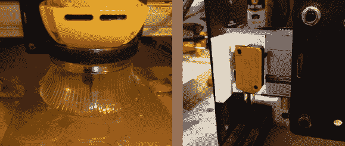
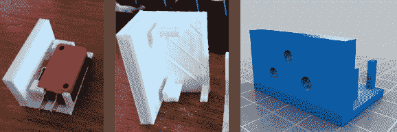
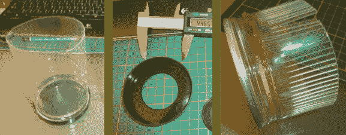

# Shapeoko 2 Mods:灰尘缓解和限位开关

> 原文：<https://hackaday.com/2014/03/26/shapeoko-2-mods-dust-mitigation-and-limit-switches/>

不久前, [Shapeoko 2](http://hackaday.com/2013/10/21/introducing-the-shapeoko-2/) 问世。如果你错过了，Shapeoko 2 是同名的第二代台式数控路由器。所有轴都在 Makerslide 和 v 形轮上滚动。X 轴和 Y 轴由皮带驱动，动力通过丝杠传递到 Z 轴。

与大多数产品一样，有些人必须修改、修改或升级他们收到的物品。如果你是一个普通的 Hackaday 读者，你可能就是其中之一。作为这些人中的一员，你会想到有一些人没有离开这台机器。

数控机床是愚蠢的，他们做你告诉他们。有时，我们人类要求他们做一些事情，导致机器试图超越其物理极限。为了防止他的机器出现人为错误，[佐拉克]决定为他的 Shapeoko 制造[限位开关支架](http://www.thingiverse.com/thing:257089)。它们是 3D 打印的，接受标准限位开关，并直接用螺栓固定在机器的 maker 滑轨上。这些类型的开关用作行程限制，如果被触发，机器将停止向该方向移动。如果你想要一套，可以从上面的链接下载。

我们最近讨论了数控镂铣机会产生多少灰尘以及如何廉价地处理这些灰尘。[杰森]用他的 Shapeoko 的这款[防尘鞋](http://www.instructables.com/id/Removable-Dust-Shoe-for-DW660-and-Shapeoko-CNC/?ALLSTEPS)打破了“便宜”的记录。它是由一个旧网球罐制成的。取下盖子，在盖子上切出一个比刳刨机外径稍小的孔。然后将盖子压配合到刳刨机上。接下来，将易拉罐的塑料部分修剪成一定长度，并在塑料上切割出狭缝，以形成类似于刷毛的薄片。这些皮瓣在切开时是直的，但是[杰森]用了一些热量来创造一个永久的向外的曲线。新创建的裙部卡入先前安装在刳刨机上的盖子中，并且可以容易地移除以更换刀头。我们希望看到下一个版本有一个真空出口来收集包含的灰尘。

