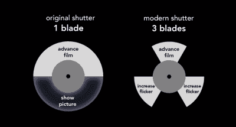

# 揭示电影放映的机制

> 原文：<https://hackaday.com/2015/07/26/shedding-light-on-the-mechanics-of-film-projection/>

你知道电影放映机是如何工作的吗？我们以为我们做到了，但[比尔·哈马克]让我们三思。我们在过去已经报道过这个工程师家伙的令人难以置信的信息丰富的视频很多次了，而且理由很充分。他不仅有清晰解释的技巧，他美妙的声音也有催眠般的安抚作用。在[比尔]的最新视频中，[他拆掉了一台 1979 年的贝尔&豪厄尔 16 毫米投影仪](http://www.youtube.com/watch?v=En__V0oEJsU)来探究其内部运作。

电影是根据视觉暂留(POV)原理运行的，该原理基本上说明了人脑从静止图像创建运动的幻觉。如果你曾经在夜空中用火花画过圆圈和数字 8，或者阅读过翻页书，那么你就已经体验过 POV 了。

电影放映机理论上没什么不同。一条赛璐珞上的静止图像在灯和透镜之间传递，透镜将图像投射到屏幕上。一种叫做梭子的装置通过把它的牙齿啮合到胶片边缘的孔中并向下移动来推动胶片。然后梭子脱开它的齿，向上向前移动，重新开始这个过程。

电影以每秒 24 帧的速率投影，这足以创建视点错觉。放映机的快门插在灯和镜头之间，挡住光线以防止电影物理运动的投影。但是这些短暂的黑暗，或者说闪烁的 T2，带来了一个问题。最初，百叶窗是做成半圆形的，所以一半的时间里会挡住光线。有人计算出，将闪烁速率增加到每秒 60-70 次会有恒定亮度的效果。所以现代快门有三个叶片:一个阻挡电影运动的投射，另外两个只是增加闪烁。

[Bill]解释投影仪如何读取光学声轨。他还深入研究了允许连续声音回放和图像帧间歇投影的机制。你再也不会以同样的方式看待投影仪了。

想了解更多关于光学声轨的知识？看看这篇详细探讨这个主题的回顾性文章。

[https://www.youtube.com/embed/En__V0oEJsU?version=3&rel=1&showsearch=0&showinfo=1&iv_load_policy=1&fs=1&hl=en-US&autohide=2&wmode=transparent](https://www.youtube.com/embed/En__V0oEJsU?version=3&rel=1&showsearch=0&showinfo=1&iv_load_policy=1&fs=1&hl=en-US&autohide=2&wmode=transparent)

谢谢你的提示，肖恩。