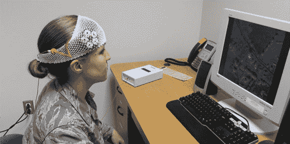

# 震撼你的大脑，让自己变得更聪明

> 原文：<https://hackaday.com/2013/05/28/shocking-your-brain-and-making-yourself-smarter/>

经颅直流电刺激——或 tDCS——是一种将电极应用于颅骨并使微小但可感知的电流通过它们的技术。电流并不大——通常在 1 或 2 毫安的数量级，但增加或减少神经活动的影响导致了一些有趣的研究。[Theo]在 Instructables 上写了一个教程来制作他自己的 tDCS 电源,它将为放置在每个人头骨上的电极提供 2 mA 的电流，供每个人进行实验。

tDCS 背后的基本思想是将正电极放在大脑中被兴奋的部分，或将负电极放在大脑中被抑制的部分。这是一项经过充分研究的技术，可以用来提高数学能力。它不是电击疗法(尽管这是治疗抑郁症和精神分裂症的有效方法),因为它会诱发癫痫发作；tDCS 只是向大脑的特定区域施加小电流来刺激或抑制功能。

[Theo]的装置是一个简单的电路，由一个晶体管、电阻和几个二极管组成，为一对电触点提供约 2 mA 的电流。有了这个电路和几个凝胶电极垫，你也可以用直流电刺激你的大脑。

当然，我们需要警告你不要把电流注入你的大脑。无论如何，[这是我们制作的四轴飞行器/眩晕枪混搭](http://hackaday.com/2012/08/27/the-taserdrone-a-shocking-mod-for-the-ar-drone/)。也不要那样做。你可能会收到撤下来的请求。