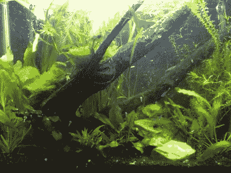

# 我们应该为鱼做游戏吗？

> 原文：<https://hackaday.com/2012/08/24/should-we-make-games-for-fish/>

我经常坐在那里，凝视着我的鱼缸，想知道我圈养的那些小动物的生活是什么样的。他们厌倦了，渴望自由吗？他们满足于他们暴饮暴食的生活方式和不断的纵容吗？

这是一个经常向高等动物提出的问题，比如动物园里的厚皮动物，或者黑猩猩。这些更容易人格化和辩论，但这些也不经常在我们的家里。

我让我的水族箱里长满了真正的植物。我有一个蓬勃发展的自然植物过滤和无脊椎动物生态系统，我真的很喜欢看他们在一天中挑选碎片和忙碌。我定期测试我的水，以确保它对所有相关人员的健康都是最佳的。但是我的鱼，嗯，就像我说的，我对它们很好奇。

[https://www.youtube.com/embed/OnBv76VQzNk?version=3&rel=1&showsearch=0&showinfo=1&iv_load_policy=1&fs=1&hl=en-US&autohide=2&wmode=transparent](https://www.youtube.com/embed/OnBv76VQzNk?version=3&rel=1&showsearch=0&showinfo=1&iv_load_policy=1&fs=1&hl=en-US&autohide=2&wmode=transparent)

这项有趣的研究与丰富鱼类生活的游戏毫无关系，但你可以看到他们有效地制作了一个游戏，在这个游戏中，鱼试图吃掉一个投影点。有些人可能会认为这是残忍的，戏弄鱼却没有奖励它的狩猎本能。不仅如此，撞击玻璃实际上会伤害鱼(你可能见过嘴唇上有严重伤口的大鱼)。

假设我们颠倒了“游戏”。许多鱼，尤其是在我的鱼缸里，都是鱼群。他们因自己人数多而感到放心。事实证明，当压力减少时，它们会活得更长，这些鱼很容易因独处或成群结队而感到压力。如果我们能在它们周围投射出一大群鱼来安慰它们自己，会怎么样？

我没有答案。我意识到我们应该解决更重要更紧迫的问题。当我看着我的鱼时，我仍然感到疑惑。