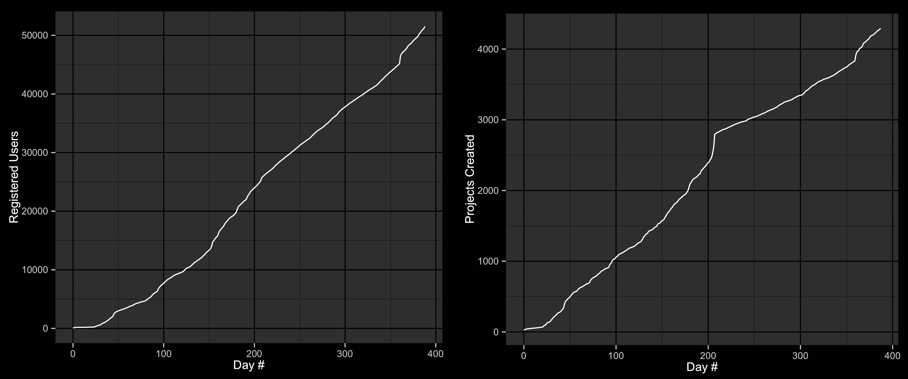
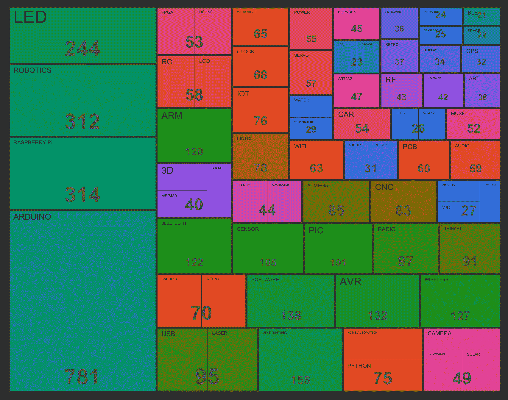
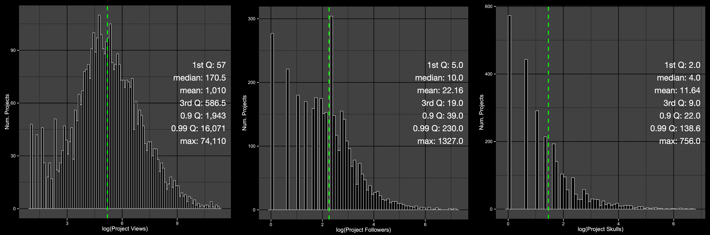
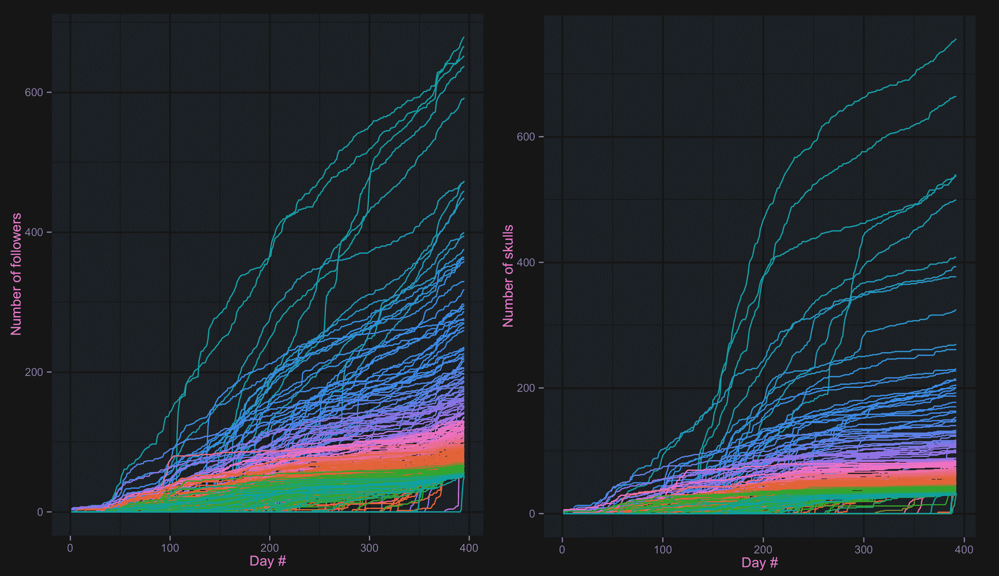
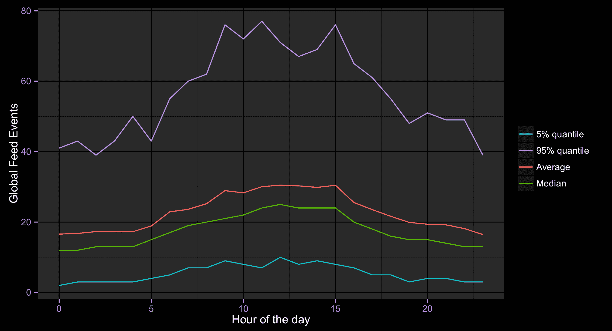

# 给我看数据:Hackaday.io Year #01

> 原文：<https://hackaday.com/2015/02/18/show-me-the-data-hackaday-io-year-01/>

今天正好是我们[向世界](http://hackaday.com/2014/02/18/hackaday-launches-our-own-hosting-site/)宣布我们软件实验室的第一个产品——[hackaday . io](https://hackaday.io)的一周年。对于我们所有人来说，这是令人难以置信的激动人心的一年，我们从一个简单的想法和原型发展成为一个真正的大规模社区，在世界上留下了自己的印记。日复一日，仔细听取来自用户的宝贵反馈，我们已经改进并前进，当时一行代码。

我们还有很长的路要走，但我们现在要暂停一下，反思一下我们已经走了多远。然后马上回去修复错误和开发新功能。

这一切都始于一个简单的想法——建立一个更好的项目托管网站。尽管有大量的项目和内容网站，每天都有新的网站出现，但这一切还是让人觉得太乏味了。我们认为我们可以做得更好。毕竟，[媒介就是消息](http://en.wikipedia.org/wiki/The_medium_is_the_message)。某物居住的地方迟早会成为其身份的关键部分。因此，为了防止出现反乌托邦式的未来，即我们都使用(虚构的)微软 Maker Suite 2020 托管我们的项目，而根本不在乎，我们开始努力提供一种替代方案。

我们很快意识到我们手上有一个更大的任务。当然，一个更好的项目托管网站会很好，但我们觉得我们真正需要的是[Brian Benchoff]已经谈论了很长时间的东西——一个“[虚拟黑客空间](http://hackaday.com/2013/07/15/were-going-to-buy-hackaday/)”不仅仅是一个你可以在完成后发布你的构建(并希望有人看到它)的地方，而是一个活生生的社区:一个你可以从一个想法开始并在其发展过程中获得反馈的地方，找到合作者，迭代，并最终构建出比你自己完成的更令人惊叹的东西。

这是 Hackaday 多年来的目标，但大多数合作都受限于帖子评论线程的有限空间，并受到文章和主题的编辑选择的影响。随着 Hackaday.io 的推出，我们为任何人开辟了一个释放创造力和专业知识的空间，并共同改变人们构建事物的方式。

## 数据

不幸的是，如今，大胆宣称我们如何改变世界几乎成了一种商品。正如大多数网络初创公司可以证明的那样，只要有一个简单的带有精美图片和一些振奋人心的信息的登陆页面，任何武断的主张就不会显得可信。

因此，我们不会试图用语言来说服你过去的一年有多棒，我们只会坚持用数据说话。

这是我们的用户和项目增长的样子:

在过去的 365 天里，Hackaday.io 已经从零增长到总共有**51838**个注册用户。更重要的是，它已经从零个项目(我们不相信预先播种内容)发展到 **4，365** 个，所有这些都是由我们了不起的社区成员创造的。

这里最令人印象深刻的部分是，它不是暂时现象的结果，而是一段时间内的持续增长。尽管 2014 年 THP 奥运会的最后期限确实导致了项目提交的加速，但大部分增长完全是自然发生的。虽然这在“社交网络”中是意料之中的事，因为它依赖于你一注册就把你所有的朋友都拉进来(想想脸书、G+、Linkedin……)，但在我们的情况下，这绝对是一个奇迹。毕竟你邀请了多少人报名 Hackaday.io？我们仍然设法增长到 50k，当时只有一个用户。

### 项目

现在，用户数量和“虚荣心”指标都很好，但我们真正要做的是构建东西。正是 4K+创造的项目的广阔空间让我们所有人都无比兴奋。在开发团队中，我们已经从熟记网站上的每一个项目，到将它作为灵感的来源，并且总是对我们每天发现的新项目感到惊讶。为了展示这是多么惊人的巨大，让我们来看看顶级类别中项目数量的分布情况:

有 70 个不同的类别，每个类别有 20 多个项目。要探索的东西太多了！不管你的兴趣有多具体，很有可能你会发现一些值得一试的东西。

### 社区

项目方面的事情从第一天开始就是网站的主要焦点，但我们也知道我们必须实现建立一个真正的“社区”的整个使命。不管我们喜不喜欢，已知的唯一方法就是添加一些可怕的“社交”功能。因此，项目/用户遵循，全球/个人饲料，最重要的是，臭名昭著的“骷髅”找到了它的网站。老实说，我们不知道是否有人会使用这些功能。我们往往不是街区里最“社会化”的人，所以我们自然会持怀疑态度。

当我们意识到我们被证明是错误的时候，我们是如此的激动！目前，网站上有**88703**用户- >用户和**105315**用户- >项目跟踪关系。显然不像脸书那样“社会化”(这也不是目标)，但我们可以看到真正的项目社区正在形成。

出于对一般极客的兴趣，我们认为我们应该用使用 [Gephi](http://gephi.github.io/) 的用户-用户图来庆祝一下(限于前 5000 名用户，因为大规模的[图形布局](http://en.wikipedia.org/wiki/Graph_drawing)是一个噩梦):

### 公共方面

现在所有这些只是冰山一角。Hackaday.io 上的所有内容都是完全开放的，大多数访问者最终都没有创建账户。仅在过去的 30 天里，我们就有 **246，270** 的独立访问者访问了该网站，导致了总计 **1，224，619** 的页面浏览量。这是 120 万条关于某人工作、合作、反馈以及所有其他创造性使用和滥用我们平台的印象。

自然的问题是——所有这些注意力是如何分配的？当然，受欢迎的项目可能会得到很多关注，但我能对我的小玩具项目有什么期待呢？难道它只是坐在那里，死标记在页面上，从来没有得到任何关注？

因此，我们调查了所有 4，365 个项目的页面浏览量和项目关注/skulls 的分布情况:

简而言之，这些告诉我们的是(对于那些不喜欢对数标度的人来说，汇总统计数据是以线性形式给出的)，那就是:

*   Hackaday.io 上有超过 400 个项目，每个项目的浏览量都超过 2000 次，拥有超过 39 名粉丝和超过 22 个头骨
*   前 40 名项目中的“精英”组每个都获得了超过 16，000 的页面浏览量、230 个追随者和 138 个头骨！
*   最重要的是——hack aday . io 上的“平均”项目获得了超过 170 次浏览、10 个关注者和 4 个头骨。

因此，即使你刚刚开始，没有突破性的想法或惊人的执行，你的项目仍然很可能让你得到一些爱，并开始收集反馈。

### 成名 15 分钟？

我们想看的另一个大问题是所有这些的长期方面。当然，我们都知道，当我们博客上的项目在某个地方成为特色时，那种感觉有多棒，我们会得到一两天神奇的关注。但是它消失了，被遗忘了。这就是网络的工作方式。

为了更好地了解 Hackaday.io 上的这种动态，我们分析了前 400 个项目及其追随者/头骨数量随时间的演变:

看到这个结果，我们非常激动！它表明，尽管像在某个地方出现这样的大事件肯定会在短期内提高人们对项目的兴趣，但大多数项目会随着时间的推移继续保持兴趣，永远不会真正消失。希望这将为项目创建者带来额外的动力，在最初的演示日之后的很长一段时间内继续改进他们的构建。

仔细查看上面的图表，你可能会注意到另一件有趣的事情，那就是追随者数量的增长和头骨数量的增长之间的滞后。事实证明，很多人可能会“追随”这个项目，如果他们发现它有前途的话，但是你需要一段时间来给他们留下足够的印象，以赢得那个珍贵的头骨。在这片土地上，这是很有价值的商品。

### 全局提要

我们想看的最后一件事是[提要](http://hackaday.io/feed)。自从引入这个功能(尤其是在重新设计之后)，它已经成为许多人日常生活的一部分，他们现在使用它来享受网站上大量的日常活动。

我们认为量化这种活动的水平会很好，所以我们分析了全局 Feed 事件的频率(创建的项目、评论、档案更新等。)在去年的每一个小时。结果如下:

这告诉我们，即使在夜晚最黑暗的时候，在可能最慢的一天，每 5-10 分钟仍会有新的东西出现在全球提要中。在繁忙的一天，在工作时间，每分钟都会有几个新项目通过 feed 传输。

虽然没有 Twitter 的全球订阅快，但还是很酷。

## 那么下一步是什么？

既然我们已经分享了所有这些数据，是时候回去工作了。像往常一样，大多数工作负载计划将是被动的，基于用户反馈或我们当时最感兴趣的功能，但下面是优先级的粗略列表:

1.  *问题/bug*——众所周知，这些永远不会结束。我们开发的功能越多，这些功能就会越多。这很好。我们的首要任务是在它们开始影响用户体验之前将其粉碎。
2.  *协作功能*–我们觉得我们需要做得更多，以便在网站上促进真正的协作项目开发。我们有一些烹饪的东西，希望很快就能展示出来。
3.  *内容托管*–在过去的一年里，我们有意避免提供任何数据托管服务。这是主要的，因为我们不想增加现有生态系统的碎片化(我们喜欢 Github，认为每个人都应该使用它)，但请求已经堆积起来，我们必须对此做些什么。理想情况下，确保您仍然可以在 Github 上托管所有代码，但使用 Hackaday.io 存储二进制资产等。
4.  私人项目/页面——这是我们试图避免的另一个问题。我们真诚地相信，通过保持所有信息的公开，伟大的事情将会发生。然而，许多人抱怨说，由于“全开放”政策，他们不愿意从零开始项目。io，担心他们可能会得到过早的批评(我个人对此也感到内疚)。因此，我们将制定一个工作流程，允许您以“私人”身份启动项目，并且只有当您准备好这样做时才打开它。也就是说，我们仍将尽一切努力鼓励人们尽可能保持开放。
5.  *公共 API*——这个早就应该发布了。我们最初的计划是在最初发布后不久发布，但发布后的现实发生了，这感觉通过裂缝。我们肯定会在接下来的几个月内推出它。
6.  *更好的 BOM/原理图管理*–干净的文档是所有开放硬件的核心和灵魂，我们现有的“组件列表”完全不公平。所以我们正准备进行一次大检修。会很好的。
7.  其他事情——我们想做的事情太多了，而时间却这么少。但是我们会变戏法。如果您对社区有价值的功能或改进有想法，请[发送给我们](http://hackaday.io/project/37-feedback-hackaday-projects)。我们会想办法让它们实现的。

再次衷心感谢在过去一年中与我们在一起并帮助我们将 Hackaday.io 发展到今天的每个人。

期待同样激动人心的 02 年！