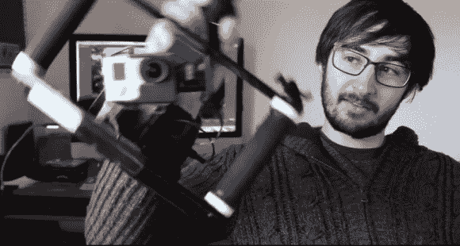

# 炫耀一个高性能的无刷电机相机万向节

> 原文：<https://hackaday.com/2013/07/04/showing-off-a-high-performance-brushless-motor-camera-gimbal/>

这里是[汤姆·帕克]展示他的 GoPro 相机的无刷电机万向节稳定器。几周前，我们看到了一个类似的项目，展示了一个 [3d 打印的四轴飞行器支架](http://hackaday.com/2013/06/18/brushless-gimbal-3d-printed-and-bolted-to-quadcopter/)。这份礼物应该握在你的手中。即使摄影师的手在俯仰和翻滚，它也能保持主体在画面中(我们认为[航空术语](http://en.wikipedia.org/wiki/Aircraft_principal_axes)在这里是最好的)。这张图片展示了他在快速地将画面从一边滚动到另一边时演示的水平摄像机。它没有补偿偏航，这是他在下一次迭代中可能会改变的。我们已经喜欢他用它得到的结果了。

在下面的视频演示中，大约 3:15 我们得到了一个关于构建本身的快速描述。他在大学开始了这个项目。制造工作包括 3D 打印机、激光切割机和真空成型机。把手是自行车把手部件。为了克服稳定系统，操作员可以使用操纵杆。如果没有这个，你将永远无法向上或向下瞄准相机，因为自动调平。

[https://www.youtube.com/embed/qA_4hGNlGsk?version=3&rel=1&showsearch=0&showinfo=1&iv_load_policy=1&fs=1&hl=en-US&autohide=2&wmode=transparent](https://www.youtube.com/embed/qA_4hGNlGsk?version=3&rel=1&showsearch=0&showinfo=1&iv_load_policy=1&fs=1&hl=en-US&autohide=2&wmode=transparent)