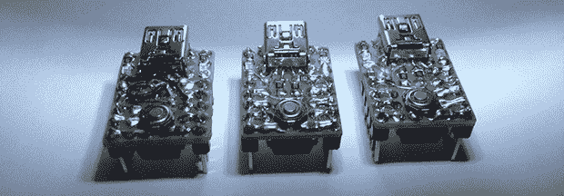

# Shrinket，家酿饰品

> 原文：<https://hackaday.com/2014/01/26/shrinket-the-homebrew-trinket/>

在过去的几个月里，我们已经看到了很多小饰品，但迄今为止，很少有人利用小饰品的极简主义。就开发板而言，这是一个相当简单的电路，经过精心规划，可以完全在 perfboard 上构建。这就是[维勒基]所做的，一个他称之为 Shrinket 的项目。

在看了小饰品的原理图后，[维莱基]认为他可以最大限度地利用这块 85 英寸电路板的小尺寸。为此，他将 uC 安装在电路板的底部，弯曲引脚，以便轻松焊接到引脚上。构建这个微型电路板的唯一真正挑战是 USB 连接器。为了将这个连接器安装在电路板上，铜焊垫被小心地从原板上刮掉，电线连接到 zeniers。

Shrinket 非常小，只有 0.6 英寸 x 0.9 英寸，是焊接技能的一个非常令人印象深刻的例子。如果你正在寻找一个项目来磨练你的自由形式焊接技能，这是一个花一两个小时的好方法。另外，你可能已经有了所需的零件(或合理的替代品)。