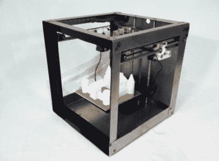

# 500 美元的 3d 打印机 Solidoodle

> 原文：<https://hackaday.com/2012/05/16/silidoodle-a-500-3d-printer/>

3D 打印机现在非常流行。我们看到他们从一个有趣的项目发展成为多个商业实体。Makerbot 似乎是商业方面的典型代表，至少曾经是。他们以前的首席运营官(塞缪尔·塞万提斯)现在负责一家名为 Solidoodle(T1)的新公司。他们的主要产品是售价 499 美元的完整 3d 打印套件。你提供电源和电脑。

Solidoodle 能够建造 6 英寸×6 英寸×6 英寸的东西。质量似乎可以和我们见过的大多数其他产品相媲美。他们在高清模式下宣传 0.1 毫米的层厚(makerbot 显示 0.2-. 3 毫米)。考虑到它的价格不到单个挤压机的 makerbot 复制器的 1/3，还不错。之后的视频展示了它的实际应用，以及带和不带可选外壳和门的情况。