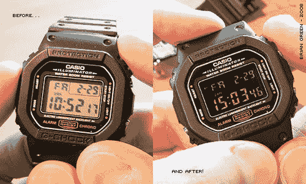

# 简单的黑客创建一个倒置的手表显示

> 原文：<https://hackaday.com/2014/04/24/simple-hack-creates-an-inverted-watch-display/>

有时候，你不得不使用回溯机来找到一个好的破解方法。早在 2008 年，[布莱恩]就在他经典的卡西欧 G-Shock 手表上表演了这个令人敬畏的[负面显示破解](http://forums.watchuseek.com/f43/how-convert-plain-dw-5600-negative-display-129102.html)。G-Shock 和大多数数字手表一样，使用扭曲向列液晶显示器。所有的[液晶显示器](http://en.wikipedia.org/wiki/Liquid-crystal_display)都是由偏光镜、玻璃和液晶组成的一层蛋糕。在非触摸屏显示器中，顶层是用光学质量粘合剂粘合的一片偏振膜。

[Brian]拆开他的手表，露出液晶面板。移除胶合的偏振膜可能是一项困难的任务。拉得太用力，薄玻璃层会破裂，导致显示器无法使用。在用 X-acto 刀做了一些耐心的工作后,[Brian]能够移除薄膜。

就像隐私监控黑客攻击一样，裸表似乎已经关闭。在手表和观看者之间夹一张线性偏光膜可以显示时间。如果将胶片旋转 90 度，整个屏幕会发生颜色反转。[Brian]喜欢反转屏幕的美感，所以他在偏移位置粘上了偏光膜。重新组装后，[布莱恩的]“定制”手表就可以戴了。

【Via [黑客新闻](https://news.ycombinator.com/item?id=7622482)