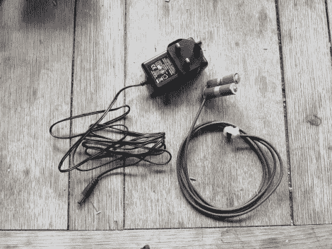

# 简单的电源适配器对专有连接器嗤之以鼻

> 原文：<https://hackaday.com/2012/06/05/simple-power-adapter-thumbs-its-nose-at-proprietary-connectors/>

[迈克·沃斯]想用他的相机拍一些延时摄影。由于它用于长时间拍摄许多照片，他不想处理电池电量不足的问题。但侧面没有标准电源插孔；相反，官方充电器由一个适配器组成，它可以代替电池插入。[Mike] [没有用特殊的电缆打破银行，而是自己制作了电池盒交流适配器](http://www.mike-worth.com/2012/06/04/making-a-mains-adapter-for-a-camera/)。

你可以看到它由两部分组成。第一种是标准壁式电源插座，输出正确的电压并具有可接受的额定电流。另一部分是适配器电缆，一端连接到相机，另一端有一个桶形插孔。[Mike]在铅笔周围卷起一些纸板，直到它与 AA 电池的直径相匹配。其中一个气缸的负极引线用图钉固定，另一个气缸的正极引线用螺钉和垫圈固定。他在上面焊了些电线，然后就开始做生意了。

他必须足够频繁地抓拍照片，以避免自动关闭功能。或者他用一些定制固件禁用了它。