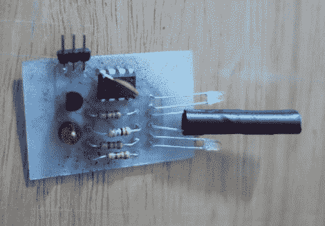

# 简单的接近传感器

> 原文：<https://hackaday.com/2012/04/20/simple-proximity-sensor/>

[达斯汀·安德鲁斯]制造了这个[附加板，它作为一个接近传感器](http://www.instructables.com/id/Make-an-Attiny13-based-IR-proximity-sensor-for-2)工作。他想为他的 Arduino 项目设计一个独立的传感器，使用一个单独的引脚作为触发器。这使他能够在物体接近传感器时提醒 Arduino，而无需轮询或 Arduino 方面的额外代码。

如你所见，板上的单个芯片负责所有工作。那是一种时尚，它们很便宜，有时你甚至可以从消费电子产品中回收它们，比如这个变色灯泡。微控制器监控光电晶体管，光电晶体管包裹在绝缘带中，与两侧的红外 LED 发射器隔离。这种设置产生了反射传感器。当物体靠近电路板时，发射器发出的红外光被反射到光电晶体管上。由于 Arduino 作为 AVR 编程器工作，您不需要特殊的硬件来为设备编程。