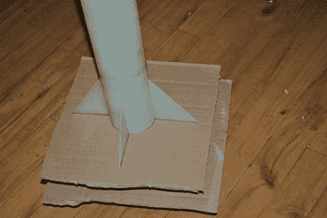

# 简单的解决方案使火箭尾翼对准变得轻而易举

> 原文：<https://hackaday.com/2012/07/10/simple-solution-makes-rocket-fin-alignment-a-breeze/>

如果你在建造模型火箭，你要确保它们直线飞行，而这大部分取决于稳定翼。这一直是装配时的一个问题。您如何确保它们没有任何变化地对齐呢？[Rrix]提到，一种技术是使用一个正方形将它们完全垂直于组装火箭的工作台。但是这仍然容易出错。他的方法[使用了几个由纸板制成的精密夹具](http://rix.si/2012/03/07/rocketry-hacks-number-1/)。

他在 Inkscape 中设计了这对夹具，然后使用文件在激光切割机上制作出来。这很管用，但把他引向了另一个可以用类似方式解决的问题。模型火箭有导轨，当飞行器加速到一个点时，导轨沿着连接到发射台的杆移动，在这个点上，鳍片有足够的作用来保持它沿着直线前进。如果那些导轨不直，你的鳍对齐将会是徒劳的。他的第二个版本的夹具包括这些指南的一个切口。