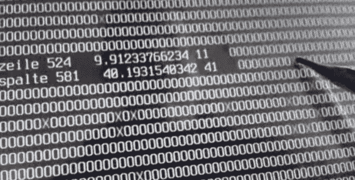

# 简单的触摸控制器释放 USB 端口

> 原文：<https://hackaday.com/2014/06/29/simple-touch-controller-frees-up-usb-port/>

[typ.o]正在做一个 Raspberry Pi 项目，发现自己的 USB 端口不够用了。该项目需要一个触摸屏界面，它占用了其中一个端口。由于他只是在文本模式下使用屏幕，他决定放弃原来的 USB 控制器，用[制作自己的](http://flipdot.org/blog/index.php?/archives/244-A-simple-Touch-Controller-for-resistive-touch-panels.html)。

曾经流行的 Attiny85 被部署来处理这项任务，并在[电阻式触摸屏](http://www.pollin.de/shop/dt/NTMwOTc4OTk-/Bauelemente_Bauteile/Aktive_Bauelemente/Displays/7_17_78_cm_Display_Set_mit_Touchscreen_LS_7T_HDMI_DVI_VGA_CVBS.html)和 Raspberry pi 之间连接，仅使用 GPIO 端口的三个引脚。Attiny85 采用 raspi 的 3 伏电源供电，因此不需要电平转换器，有助于保持他的电路板超级简单。

被触摸字符位置的校准和计算由运行在 raspi 上的 Python 脚本完成。[typ.o]是亲亲原理的粉丝，而且表现出来了。请务必查看他的网站，获取所有源代码、原理图和演示这一简单而有效的解决方案的视频。