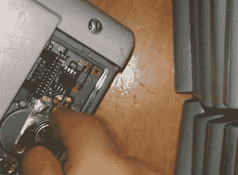

# 更换游戏机推车电池同时保留游戏保存的简单技巧

> 原文：<https://hackaday.com/2012/05/02/simple-trick-for-replacing-game-boy-cart-batteries-while-retaining-game-saves/>

[Adr990]希望确保他的 Game Boy 游戏保存不会因电池老化而丢失。它们存储在 SRAM 中，在盒子里有一个小硬币单元，当不玩游戏时，它可以保持内存的能量。但是，如果您为了更换电池而拔出电池，数据将在此过程中丢失。原来[你不用太费力就可以热插拔电池](http://www.youtube.com/watch?v=4KQr_X4GzeM)。正如休息后的视频所示，他拆开了墨盒的外壳，然后在游戏机打开的情况下更换了电池。边缘连接器供电，当备用电池被移除时，其将保持 SRAM 活动。我们确信这也可以用板凳供应来完成，但是你需要在冒险拯救那些珍贵的游戏之前做你自己的测试。

另一个选择是在更换电池之前备份你的 SRAM。我们已经看到[一个基于 AVR 的弹夹转储器](http://hackaday.com/2011/05/09/avr-gameboy-dumper/)，还有[一个使用 Arduino](http://hackaday.com/2011/03/20/gameboy-rom-backups-using-an-arduino/) 。两者都应该能够读写 SRAM 数据。

[https://www.youtube.com/embed/4KQr_X4GzeM?version=3&rel=1&showsearch=0&showinfo=1&iv_load_policy=1&fs=1&hl=en-US&autohide=2&wmode=transparent](https://www.youtube.com/embed/4KQr_X4GzeM?version=3&rel=1&showsearch=0&showinfo=1&iv_load_policy=1&fs=1&hl=en-US&autohide=2&wmode=transparent)