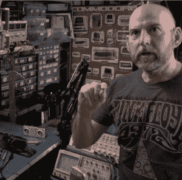
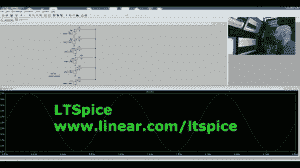
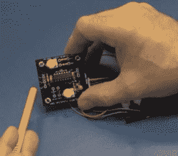
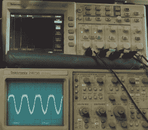
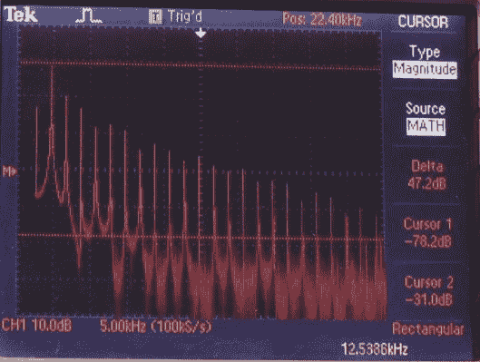

# 正弦波、方波和偶尔的 FFT

> 原文：<https://hackaday.com/2014/10/01/sine-waves-squares-waves-and-the-occasional-fft/>

在我的电子职业生涯早期(20 世纪 70 年代中期)，我开始意识到谐波和不同形状波形的声音，因为我是[爱默生·莱克和帕尔默]、[平克·弗洛伊德]、[是的]的狂热粉丝，这个名单还在继续。我知道[卡恩邪恶 9]的每个音符，可以听到它下面的扫频滤波器和基波形状。

[https://www.youtube.com/embed/0R8qGPXv0JM?version=3&rel=1&showsearch=0&showinfo=1&iv_load_policy=1&fs=1&hl=en-US&autohide=2&wmode=transparent](https://www.youtube.com/embed/0R8qGPXv0JM?version=3&rel=1&showsearch=0&showinfo=1&iv_load_policy=1&fs=1&hl=en-US&autohide=2&wmode=transparent)

我记得我开始了解到，方波是基波和(奇数)谐波频率的集合，可以用来指示频率响应。如果高频消失，方波的锐边会变圆。反之亦然，如果低频消失，方波就不能“保持”它的值，顶部平台将开始下降。

 使用一个【SPICE】的副本一个自由电路仿真应用，我创建了几个正弦波源，并把它们加在一起。从这里可以看出，当我加入越来越多的被称为谐波的主频倍数的信号时，这些波组合成一个方波，看起来更方。构建方波时，仅使用奇次谐波，因为偶次谐波往往会相互抵消。

既然我们可以从多个信号中构建一个方波，那么我们就有理由将一个波形分离出来，并显示其组成部分或信号。

进入频谱分析仪；在这种情况下，我的数字[Tektronix]示波器会以快速傅立叶变换(FFT)的形式进行一些运算。在这次演示中，我把 102 磅[HP]的射频频谱分析仪放在了工作台下面的角落里。

果不其然，奇次谐波就在它们应该在的地方突出来了。我可以把一把小尺子放在浪尖上，让它们形成一条直线。这是可能的，因为显示器本身已经转换成对数标度。

我倾向于抨击这些总是高于基波的频率如何在 RF 频谱中产生噪声，以及这些波如何在传输线、接地层、孔径和天线中相互作用。相反，我将回到我的根本，把这些信号放在一个扬声器里，这样他们就可以被听到。很容易听到来自[ELP 幸运儿]的音符，当仔细聆听时，你会开始将正弦波失真等同于“喷雾”或额外的谐波，这些谐波给合成器上播放的音符带来一些深度。玩玩这个。谁知道呢，也许你最终会让乐队重聚呢？

