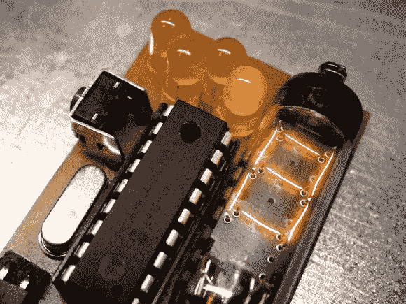

# 一位数时钟

> 原文：<https://hackaday.com/2014/02/09/single-digit-numitron-clock/>

上面的看起来像数码管，但它是一个数码管:谢妮的低电压朋友，也是一位数数码管时钟的一部分。如果你对 Numitrons 不熟悉，我们建议你看看几年前我们在[的帖子，里面有一个帮助你跟上进度的教程。](http://hackaday.com/2011/12/21/numitron-tube-tutorial/)

[pinomelean]制造了这个小装置来捕捉一个蒸汽朋克风格的外观，对于一个小到可以戴在手腕上的时钟来说很便宜。该构建使用定制 PCB 上的 PIC16F84A uC 和 4MHz 晶振。侧面的一个小按钮让佩戴者设定时间。与上个月的[振动时钟类似，Numitron 时钟并不完美，尽管它更精确:每 3 天只快一分钟。](http://hackaday.com/2014/01/10/a-vibrating-timepiece/)

休息后看看视频，看看它是如何设置和记录时间的。不过，理解如何阅读时钟可能需要一点时间。四个发光二极管中的每一个都指示 Numitron 管中的数字所属的位置。发光二极管从左到右依次点亮，一次显示一个数字。

[https://www.youtube.com/embed/mcvc7CEj5JM?version=3&rel=1&showsearch=0&showinfo=1&iv_load_policy=1&fs=1&hl=en-US&autohide=2&wmode=transparent](https://www.youtube.com/embed/mcvc7CEj5JM?version=3&rel=1&showsearch=0&showinfo=1&iv_load_policy=1&fs=1&hl=en-US&autohide=2&wmode=transparent)