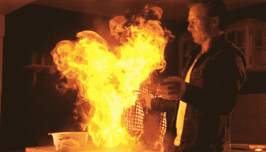

# 随机事物的慢动作破坏

> 原文：<https://hackaday.com/2012/04/22/slow-motion-destruction-of-random-things/>

虽然我们不能告诉你这和黑客攻击有什么关系，但是我们总是和你分享一些被破坏的视频。总是有人在评论中大声疾呼这是多么浪费和/或危险。这个来自丹麦电视节目*愚蠢而危险*的片段非常符合这个描述。这也太棒了。

我们真的不知道到底是什么吸引我们看这些视频。这是替代性破坏，还是可能是我们天生喜欢慢动作？

[via [Dvice](http://dvice.com/archives/2012/04/enjoy-an-epic-v.php)

[https://www.youtube.com/embed/lUZ-e2SkeMI?version=3&rel=1&showsearch=0&showinfo=1&iv_load_policy=1&fs=1&hl=en-US&autohide=2&wmode=transparent](https://www.youtube.com/embed/lUZ-e2SkeMI?version=3&rel=1&showsearch=0&showinfo=1&iv_load_policy=1&fs=1&hl=en-US&autohide=2&wmode=transparent)