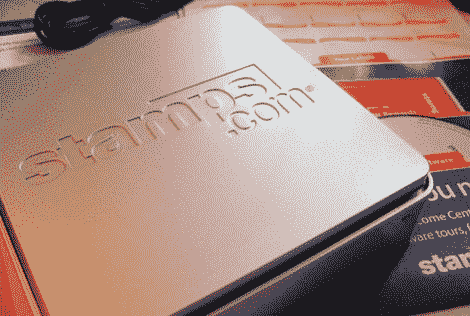
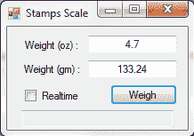
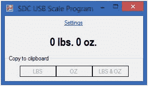
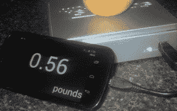

# 小规模项目使用蜗牛邮件邮件规模

> 原文：<https://hackaday.com/2014/04/26/small-scale-projects-use-snail-mail-mail-scale/>

当你注册他们的服务时，Stamps.com 提供免费的 USB 秤。这种秤的第一个版本没有显示器。为了找到物体的重量，磅秤必须与运行 stamps.com 软件的计算机相连。如果您碰巧有一台旧秤或者能够买到便宜的秤，您可能会有兴趣在 stamps.com 服务之外使用它。如何做到这一点有几种选择。

[Stamps.com 缩放工具](http://www.vadimtabakman.com/stampscom-scale-tool-1.aspx) 

虽然标题中有 stamps.com，但两者并无关联。这是一个简单的程序，以盎司和克显示秤的输出。有两种模式，实时模式不断更新显示的输出和快照模式,“称重”按钮记录并显示当时的重量。

[Stamps.com USB 电子秤读卡器](http://sourceforge.net/projects/sdcusbscaleapp/)

这是另一个类似的基于 Windows 的秤阅读器程序。它声称可以与所有 stamps.com 比例模型一起工作。这有一个独特的功能，它挂在系统托盘中，并在检测到重量变化时弹出。显示金额时，下方的 3 个按钮可让您快速将值复制到剪贴板。

 [终极尺度](https://play.google.com/store/apps/details?id=com.theultimatelabs.scale)

如果你没有基于 Windows 的电脑和/或你想称一个苹果，那么终极秤就是你的。这个 Android 应用程序会在连接秤时自动启动，并在您的手机上显示重量。轻按主重量文本会将秤归零。对于那些懒得用眼睛的人来说，这个数字也是大声说出来的。如果你知道被称物体的密度，这个 app 还会计算体积！

你的选择还不够多吗？我们之前报道过一个 Arduino 项目，[在 LCD 屏幕](http://hackaday.com/2013/09/13/adding-a-display-to-a-usb-digital-scale/)上显示秤的测量值。