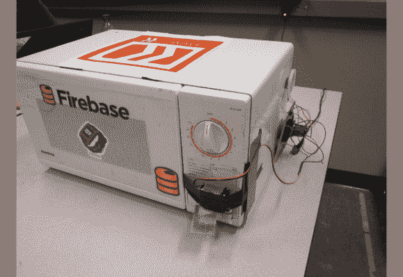

# 智能微波炉向您展示如何做到这一点

> 原文：<https://hackaday.com/2014/04/14/smart-microwave-shows-you-how-its-done/>

你的微波炉还有技术问题吗？不知道吃了一半的热袋要放多久？有了 **nextWAVE** (商标正在申请中)你不需要知道！只需扫描条形码，[让 nextWave 做它的事情](http://blog.kashevdalmia.com/2014/04/13/hackillinois-2014/)——无线！

[卡舍夫·达尔米亚]，[达里奥·阿兰吉斯]，[布雷迪·萨尔兹]和[艾哈迈德·苏希尔]刚刚参加了 2014 年黑客马拉松比赛，他们的项目是这个[超棒的智能微波炉。](http://hackillinois2014s.challengepost.com/submissions/22532-nextwave)它使用一个 [Spark Core](https://www.spark.io/) 微控制器来控制微波炉，并通过 Wi-Fi 进行无线通信。他们开发了一个 Android 应用程序，允许你扫描条形码，然后在一个 [Firebase](https://www.firebase.com/) 数据库中查找，以确定最佳(众包)烹饪时间。为了方便任何人使用，微波炉上放置了一个 app link NFC 标签，便于安装。

它甚至会在完成后自动开门——然后[播放《时髦小镇》](https://www.youtube.com/watch?v=HRDc31Co8sI)！哦，它还有一个 Pebble 应用程序，可以显示食物的剩余时间。我们认为这款[树莓派微波炉](http://hackaday.com/2013/07/12/the-most-advanced-microwave-youll-ever-own/)可能会让它物有所值…

[https://www.youtube.com/embed/uaeWA7mdfUo?version=3&rel=1&showsearch=0&showinfo=1&iv_load_policy=1&fs=1&hl=en-US&autohide=2&wmode=transparent](https://www.youtube.com/embed/uaeWA7mdfUo?version=3&rel=1&showsearch=0&showinfo=1&iv_load_policy=1&fs=1&hl=en-US&autohide=2&wmode=transparent)