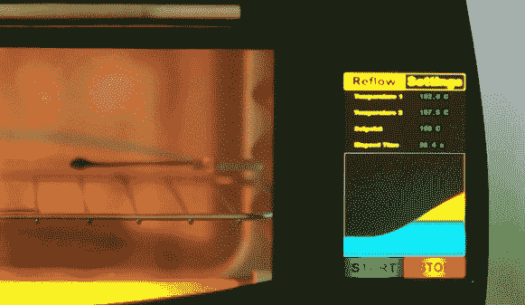

# 智能回流炉设计过度

> 原文：<https://hackaday.com/2014/02/22/smart-reflow-oven-is-over-engineered/>

[Linas]逆向设计了一个 AMOLED HTC 800×480 屏幕，并将其与 STM32 微控制器以及其他一些组件相连接，以制作一个[华丽的超工程回流炉](http://www.youtube.com/watch?v=j45JHzq7oNU&feature=youtu.be)。

在罩下有一个 PSoC5LP PID 控制器来控制 800W IR 加热线圈和两个用于感测的 K 型热电偶。

真正的美在于为 HTC AMOLED 屏幕供电的相对较小的 STM32 芯片。AMOLED 屏幕具有高对比度和宽视角，从所有正面视角都能看到清晰的画面。尽管突破了 STM32F429i 的极限，但[Linas]成功地制作了一个非常好的“自制”用户界面，包括用户可配置的设置和当前温度图表。

用户界面看起来非常灵敏，使用一些聪明的编程，[Linas]能够利用屏幕的潜力来提供美丽的情节和界面小部件。

[Linas]详细介绍了与屏幕渲染相关的编程，所以请务必在跳转之后查看视频。

[https://www.youtube.com/embed/j45JHzq7oNU?version=3&rel=1&showsearch=0&showinfo=1&iv_load_policy=1&fs=1&hl=en-US&autohide=2&wmode=transparent](https://www.youtube.com/embed/j45JHzq7oNU?version=3&rel=1&showsearch=0&showinfo=1&iv_load_policy=1&fs=1&hl=en-US&autohide=2&wmode=transparent)