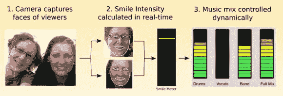

# 微笑仪用法瑞尔的快乐来回应你的表情

> 原文：<https://hackaday.com/2014/05/24/smile-meter-reacts-to-your-expressions-with-pharrells-happy/>

这是对网络摄像头和一些面部识别软件的巧妙使用——他们称之为 [Happy ++](http://web.media.mit.edu/~rmorris/happy++/) ，它会根据你笑的多少(或者根本不笑)让 DJ(Pharrell)开心！).

这是麻省理工学院媒体实验室今年春季活动的另一个项目，由[Rob，Dan & Javier]完成。面部跟踪软件是从一个更老的项目中重复使用的，即[麻省理工学院情绪计](http://moodmeter.media.mit.edu/)，这是一个聪明的装置，在校园里有几个区域跟踪走过的学生的明显“幸福”。

为了制作这个节目，他们把歌曲 Happy 分成了不同的部分。鼓，人声，乐队，和完整的组合。当网络摄像头识别出一个微笑时，它会记录下微笑的强度，进而提高人声和乐队的音量。如果没有微笑，那就只有鼓声。

也许这个项目最有趣的部分是它与一个群体的互动——即使人们没有注意，它仍然会跟踪他们的表情，并对他们的“情绪”做出反应。

> 如果团队爆发出笑声并开始微笑，技术会立即跟进，音乐会变得更加灿烂。就好像这项技术与对话的有效轮廓合拍，并有能力像其他人一样做出反应，尽管是用自己的语言。

[https://player.vimeo.com/video/95801387](https://player.vimeo.com/video/95801387)[https://player.vimeo.com/video/95883686](https://player.vimeo.com/video/95883686)